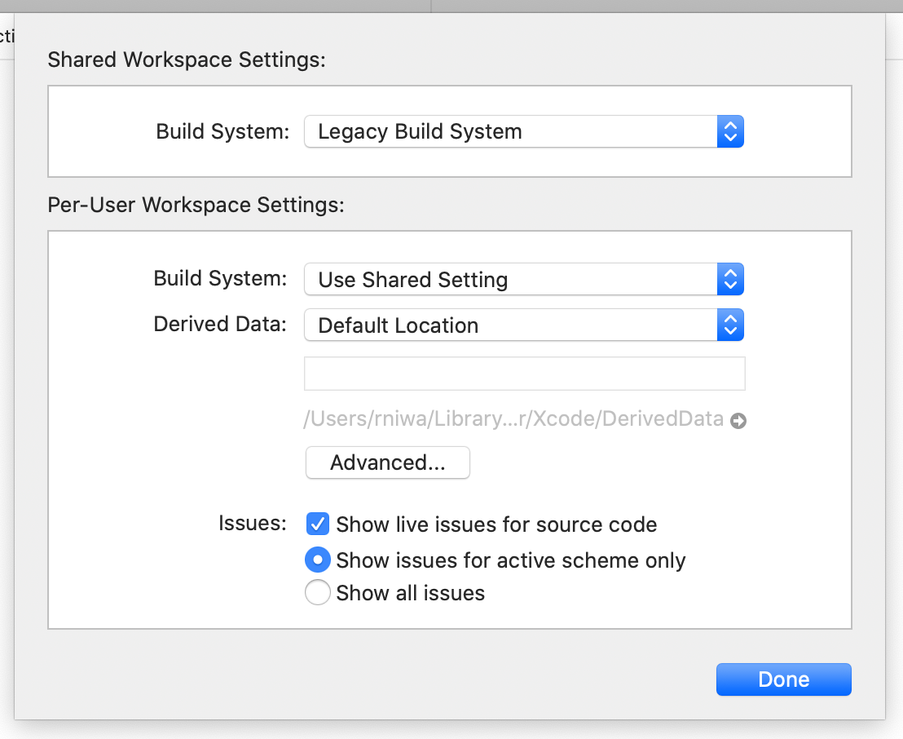
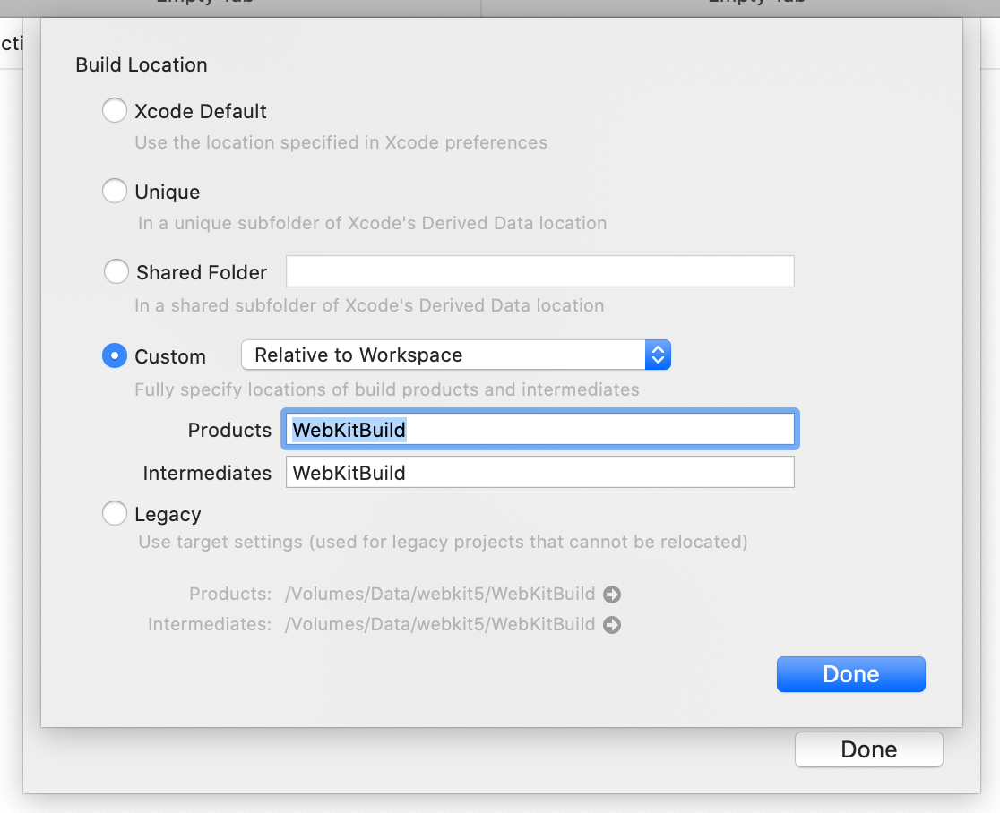
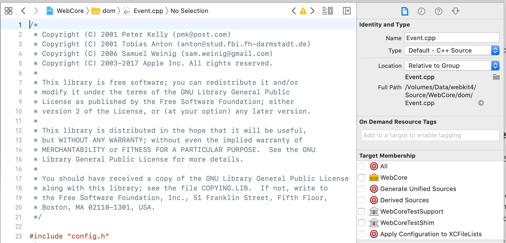
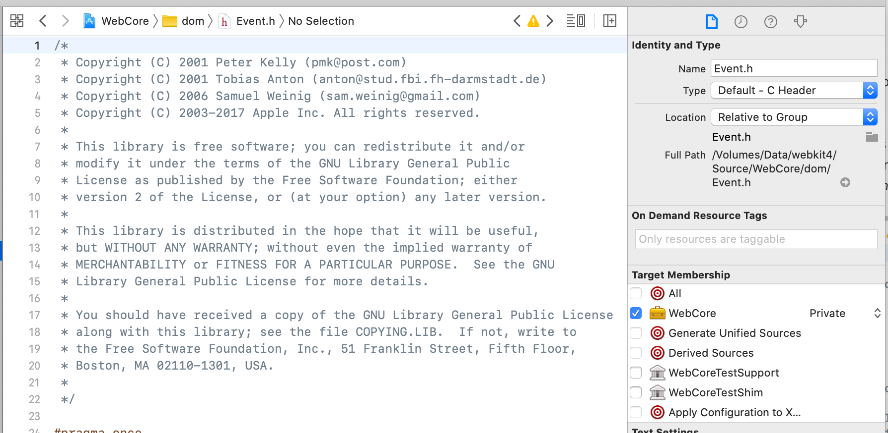
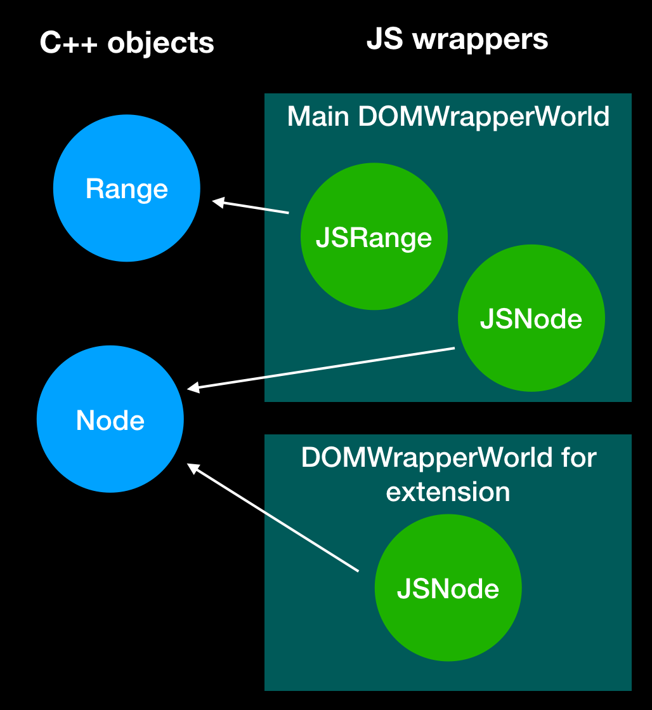
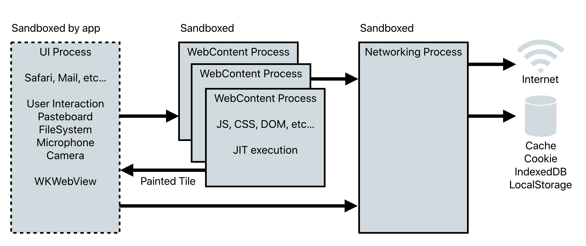
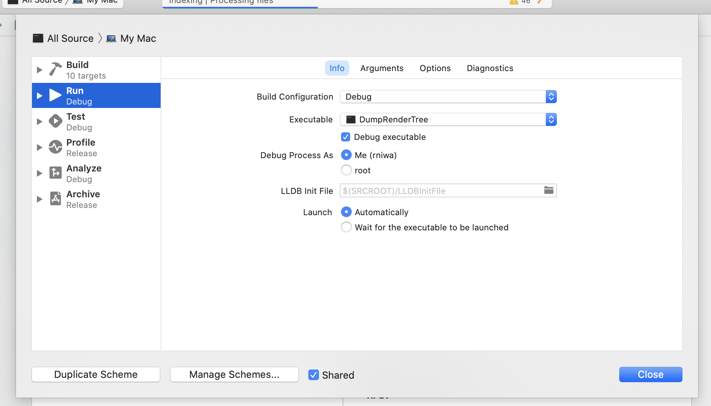
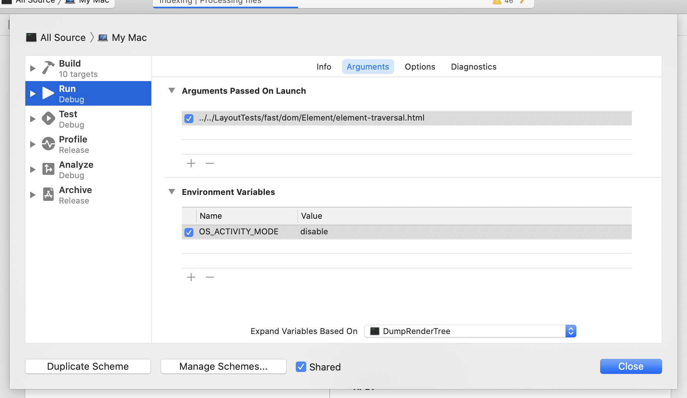
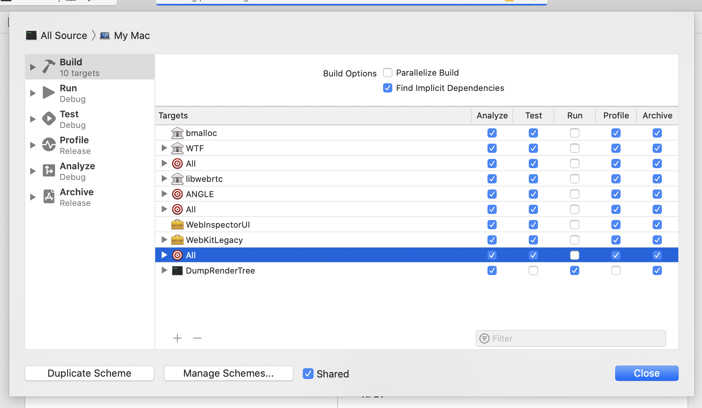

#  Introduction to WebKit

## What is WebKit?

[WebKit](https://webkit.org/) is an open-source Web browser engine.
It’s a framework in macOS and iOS, and used by many first party and third party applications including Safari, Mail, Notes, Books, News, and App Store.

The WebKit codebase is mostly written in C++ with bits of C and assembly, primarily in JavaScriptCore, and some Objective-C to integrate with Cocoa platforms.

It primarily consists of the following components, each inside its own directory in [Source](https://trac.webkit.org/browser/webkit/trunk/Source):

* **bmalloc** - WebKit’s malloc implementation as a bump pointer allocator. It provides an important security feature, called IsoHeap,
    which segregates each type of object into its own page to prevent type confusion attacks upon use-after-free.
* **WTF** - Stands for Web Template Framework. WebKit’s template library.
    The rest of the WebKit codebase is built using this template library in addition to, and often in place of, similar class templates in the C++ standard library.
    It contains common container classes such as Vector, HashMap (unordered), HashSet, and smart pointer types such as Ref, RefPtr, and WeakPtr used throughout the rest of WebKit.
* **JavaScriptCore** - WebKit’s JavaScript engine; often abbreviated as JSC.
    JSC parses JavaScript and generates byte code, which is then executed by one of the following four tiers.
    Many tiers are needed to balance between compilation time and execution time.
    Also see Phil's blog post about [Speculation in JavaScriptCore](https://webkit.org/blog/10308/speculation-in-javascriptcore/).
    * **Interpreter** - This tier reads and executes instructions in byte code in C++.
    * **Baseline JIT** - The first Just In Time compiler tier serves as the profiler as well as a significant speed up from the interpreter.
    * **DFG JIT** - Data Flow Graph Just In Time compiler uses the data flow analysis to generate optimized machine code.
    * **FTL JIT** - Faster than Light Just In Time compiler which uses [B3 backend](https://webkit.org/blog/5852/introducing-the-b3-jit-compiler/).
        It’s the fastest tier of JSC.
    JavaScriptCode also implements JavaScriptCore API for macOS and iOS applications.
* **WebCore** - The largest component of WebKit, this layer implements most of the Web APIs and their behaviors.
    Most importantly, this component implements HTML, XML, and CSS parsers and implements HTML, SVG, and MathML elements as well as CSS.
    It also implements [CSS JIT](https://webkit.org/blog/3271/webkit-css-selector-jit-compiler/), the only Just In Time compiler for CSS in existence.
    It works with a few tree data structures:
    * **Document Object Model** - This is the tree data structure we create from parsing HTML.
    * **Render Tree** - This tree represents the visual representation of each element in DOM tree computed from CSS and also stores the geometric layout information of each element.
* **WebCore/PAL and WebCore/platform** - Whilst technically a part of WebCore, this is a platform abstraction layer for WebCore
    so that the rest of WebCore code can remain platform independent / agnostic across all the platforms WebKit can run on: macOS, iOS, Windows, Linux, etc...
    Historically, most of this code resided in WebCore/platform.
    There is an ongoing multi-year project to slowly migrate code to PAL as we remove the reverse dependencies to WebCore.
* **WebKitLegacy** (a.k.a. WebKit1) - This layer interfaces WebCore with the rest of operating systems in single process and implements WebView on macOS and UIWebView on iOS.
* **WebKit** (a.k.a. WebKit2) - This layer implements the multi-process architecture of WebKit, and implements WKWebView on macOS and iOS.
    WebKit’s multi-process architecture consists of the following processes:
    * **UI process** - This is the application process. e.g. Safari and Mail
    * **WebContent process** - This process loads & runs code loaded from websites.
        Each tab in Safari typically has its own WebContent process.
        This is important to keep each tab responsive and protect websites from one another.
    * **Networking process** - This process is responsible for handling network requests as well as storage management.
        All WebContent processes in a single session (default vs. private browsing) share a single networking session in the networking process.
* **WebInspector / WebDriver** - WebKit’s developer tool & automation tool for Web developers.

## Contributing to WebKit

There are many ways to get involved and contribute to the WebKit Project.
Filing a new bug, fixing a bug, or adding a new feature.

There are three different kinds of contributors in the WebKit project.

 * Contributor - This category encompasses everyone. Anyone who files a bug or contributes a code change or reviews a code change is considered as a contributor
 * Committer - A committer is someone who has write access to [WebKit's subversion repository](https://svn.webkit.org/repository/webkit/).
 * Reviewer - A reviewer is someone who has the right to review and approve code changes other contributors proposed.

See [Commit and Review Policy](https://webkit.org/commit-and-review-policy/) for more details on how to become a committer or a reviewer.

### Staying in Touch

Before getting in touch with WebKit developers using any of the avenues below, make sure that you have checked our page on how to ask [questions about WebKit](https://webkit.org/asking-questions/).

You can find WebKit developers, testers, and other interested parties on the [#WebKit Slack workspace](https://webkit.slack.com/).
[Join the WebKit slack](https://join.slack.com/t/webkit/shared_invite/enQtOTU3NzQ3NTAzNjA0LTc5NmZlZWIwN2MxN2VjODVjNzEyZjBkOWQ4NTM3OTk0ZTc0ZGRjY2MyYmY2MWY1N2IzNTI2MTIwOGVjNzVhMWE),
and stay in touch.

## Bug tracking in WebKit

[bugs.webkit.org](https://bugs.webkit.org/) hosted is the primary bug tracking tool we use.
When making a code change, we post a code change (patch) on this website.

### Filing a bug and editing bugs

To [file a new WebKit bug](https://bugs.webkit.org/enter_bug.cgi), see [reporting bugs](https://webkit.org/reporting-bugs/).

To edit an existing bug, you may need [editbug-bits](https://webkit.org/bugzilla-bits/).

### Code Reviews in bugs.webkit.org

We also use [bugs.webkit.org](https://bugs.webkit.org/) to upload & review code changes to WebKit.
You can post a code change with `Tools/Scripts/webkit-patch upload`.
Note that the `webkit-patch` script only looks for changes below current directory,
so generally you should change the current directory to the top-level directory of a WebKit first.

When a patch is posted on [bugs.webkit.org](https://bugs.webkit.org/) requesting a formal code review (r? flag is set),
The Early Warning System (a.k.a. EWS) will automatically build and run tests against your code change.
This allows contributors to find build or test failures before committing code changes to the WebKit’s primary Subversion repository.

Once a patch is approved by a reviewer (r+ flag is set),
then the patch can be either committed directly into the Subversion repository by a WebKit committer, 
who has write access to the Subversion repository,
or via the commit queue which can be requested by setting cq? flag and approved by any WebKit committer by setting cq+.

The Subvesion commit message should be created by `Tools/Scripts/commit-log-editor` based on the change log entries.
`Tools/Scripts/webkit-patch land` does this automatically.

### Security Bugs in bugs.webkit.org

Security bugs have their own components in [bugs.webkit.org](https://bugs.webkit.org/).
We’re also working on a new policy to delay publishing tests for security fixes until after the fixes have been widely deployed.

_***Do not post a patch or describe a security bug in a bug that is not in security component of bugs.webkit.org.***_

## Getting started with WebKit

### Getting Code

See [Getting the Code](https://github.com/WebKit/webkit/blob/master/ReadMe.md#getting-the-code)

### Adding Tools to PATH

For convenience, you can add `Tools/Scripts/` to your path as follows in `~/.zshrc` like so:

```sh
export PATH=$PATH:/Volumes/Data/webkit/Tools/Scripts/
```

where `/Volumes/Data/webkit` is the path to a WebKit checkout.

This will allow you to run various tools you by name instead of typing the full path of the script.

### Updating checkouts

There is a script to update a WebKit checkout: `Tools/Scripts/update-webkit`. This script will automatically merge change logs mentioned below.

### Building WebKit

[See Building WebKit](https://github.com/WebKit/webkit/blob/master/ReadMe.md#building-webkit)

### Fixing mysterious build or runtime errors after Xcode upgrades

If you see mysterious build failures or if you’ve switched to a new version of
macOS or Xcode, delete the `WebKitBuild` directory.
`make clean` may not delete all the relevant files,
and building after doing that without deleting the `WebKitBuild` directory may result in mysterious build or dyld errors.

### Building with Address Sanitizer to investigate memory corruption bugs

To build [Address Sanitizer](https://en.wikipedia.org/wiki/AddressSanitizer) or ASan builds to analyze security bugs,
run `Tools/Scripts/set-webkit-configuration --asan --release`.
This will enable ASan build. If want to attach a debugger, you can also specify `--debug` instead of `--release`.
Once you don’t need to build or run ASan anymore, you can specify `--no-asan` in place of `--asan` to disable ASan.
Note that this configuration is saved by creating a file called Asan in the WebKitBuild directory,
so if you are trying to do a clean Asan build by deleting the build directory you need to rerun this command.

### Using Xcode

You can also use Xcode to build & debug WebKit. Open `WebKit.xcworkspace` at the top level directory.

In order to make Xcode use build files built by `make` command above,
go to File > Workspace Settings... > Advanced... > Custom > Relative to Workspace
and adjust the relative paths of Products and Intermediates to point to `WebKitBuild` directory.


Note that debugging WebCore code typically requires attaching to the relevant WebContent process,
not the application process, which is mostly running code in [Source/WebKit/UIProcess](https://trac.webkit.org/browser/webkit/trunk/Source/WebKit/UIProcess).
Depending on what you’re debugging, you’d have to attach & debug different processes in the coalition.

You may find it useful to use the debug helpers under `Tools/lldb/lldb_webkit.py`.
This can be added to `~/.lldbinit` for automatic loading into LLDB on launch by adding the line `command script import {Path to WebKit}/Tools/lldb/lldb_webkit.py`.
For more details, see the Wiki article on [lldb formatters](https://trac.webkit.org/wiki/lldb%20formatters).

When debugging a debug build in LLDB, there are also a few functions that can be called on objects that will dump debugging info.

* RenderObject
    * showNodeTree()
    * showLineTree()
    * showRenderTree()
* Node
    * showTree()
    * showNodePath()
    * showTreeForThis()
    * showNodePathForThis()

## Correctness Testing in WebKit

WebKit is really big on test driven development, we have many types of tests.

* **JavaScript tests** - Resides in top-level [JSTests](https://trac.webkit.org/browser/webkit/trunk/JSTests) directory.
    This is the primary method of testing JavaScriptCore. Use `Tools/Scripts/run-javascriptcore-tests` to run these tests.
* **Layout tests** - Resides in top-level [LayoutTests](https://trac.webkit.org/browser/webkit/trunk/LayoutTests) directory.
    This is the primary method of testing WebCore.
    If you’re making code changes to WebCore, you typically run these tests. Use `Tools/Scripts/run-webkit-tests` to run these.
    Pass `-1` to run tests using WebKitLegacy (a.k.a. WebKit1).
    [WebKitTestRunner](https://trac.webkit.org/browser/webkit/trunk/Tools/WebKitTestRunner) is used to run these tests for WebKit2,
    and [DumpRenderTree](https://trac.webkit.org/browser/webkit/trunk/Tools/DumpRenderTree) is used to these tests for WebKit1.
    There are a few styles of layout tests but all of them have a test file and expected result (ends with -expected.txt),
    and the test passes if the test file’s output matches that of the expected result.
* **API tests** - Reside in [Tools/TestWebKitAPI](https://trac.webkit.org/browser/webkit/trunk/Tools/TestWebKitAPI),
    these are [GTests](https://en.wikipedia.org/wiki/Google_Test) that test APIs exposed by JavaScriptCore,
    WebKitLegacy, and WebKit layers as well as unit tests for selected WTF classes.
    WebKit does not use [XCTests](https://developer.apple.com/documentation/xctest).
    Use `Tools/Scripts/run-api-tests` to run these tests.
    Because these API tests are sequentially, it’s preferable to write layout tests when possible.
* **Bindings tests** - Reside in [Source/WebCore/bindings/scripts/test](https://trac.webkit.org/browser/webkit/trunk/Source/WebCore/bindings/scripts/test),
    these are tests for WebCore’s binding code generator.
    Use `Tools/Scripts/run-bindings-tests` to run these tests.
* **webkitpy tests** - Tests for WebKit’s various Python scripts in [Tools/Scripts/webkitpy](https://trac.webkit.org/browser/webkit/trunk/Tools/Scripts/webkitpy).
    Use `Tools/Scripts/test-webkitpy` to run these tests.
* **webkitperl tests** - Tests for WebKit’s various Perl scripts in [Tools/Scripts/webkitperl](https://trac.webkit.org/browser/webkit/trunk/Tools/Scripts/webkitperl).
    Use `Tools/Scripts/test-webkitperl` to run these tests.

## Performance Testing in WebKit

The WebKit project has a "no performance regression" policy.
We maintain the performance of the following of the benchmarks and are located under [PerformanceTests](https://trac.webkit.org/browser/webkit/trunk/PerformanceTests).
If your patch regresses one of these benchmarks even slightly (less than 1%), it will get reverted.

* **JetStream2** - Measures JavaScript and WASM performance.
* **MotionMark** - Measures graphics performance.
* **Speedometer 2** - Measures WebKit’s performance for complex web apps.

The following are benchmarks maintained by Apple's WebKit team but not available to other open source contributors
since Apple doesn't have the right to redistribute the content.
If your WebKit patch regresses one of these tests, your patch may still get reverted.

* **RAMification** - Apple's internal JavaScript memory benchmark.
* **ScrollPerf** - Apple's internal scrolling performance tests.
* **PLT** - Apple's internal page load time tests.
* **Membuster / PLUM** - Apple's internal memory tests. Membuster for macOS and PLUM for iOS and iPadOS.

## Contributing code to WebKit

WebKit has a rigorous code contribution process and policy in place to maintain the quality of code.

### Coding style

Code you write must follow WebKit’s [coding style guideline](https://webkit.org/contributing-code/#code-style-guidelines).
You can run `Tools/Scripts/check-webkit-style` to check whether your code follows the coding guidelines or not
(it can report false positives or false negatives).
If you use `Tools/Scripts/webkit-patch upload` to upload your patch,
it automatically runs the style checker against the code you changed so there is no need to run `check-webkit-style` separately.

Some older parts of the codebase do not follow these guidelines.
If you are modifying such code, it is generally best to clean it up to comply with the current guidelines.

### Convenience Tools

`Tools/Scripts/webkit-patch` provides a lot of utility functions like applying the latest patch on [bugs.webkit.org](https://bugs.webkit.org/) (`apply-from-bug`)
and uploading a patch (`upload --git-commit=<commit hash>`) to a [bugs.webkit.org](https://bugs.webkit.org/) bug.
Use `--all-commands` to the list of all commands this tool supports.

### Licensing

Much of the code we inherited from [KHTML](https://en.wikipedia.org/wiki/KHTML) is licensed under [LGPL](https://en.wikipedia.org/wiki/GNU_Lesser_General_Public_License).
New code contributed to WebKit will use the [two clause BSD license](https://trac.webkit.org/browser/trunk/Source/WebCore/LICENSE-APPLE).
When contributing new code, update the copyright date.
When moving the existing code, you need to include the original copyright notice for the moved code
and you should also not change the license, which may be BSD or LGPL depending on a file, without the permission of the copyright holders.

### Regression Tests

Once you have made a code change, you need to run the aforementioned tests (layout tests, API tests, etc...)
to make sure your code change doesn’t break existing functionality.
These days, uploading a patch on [bugs.webkit.org](https://bugs.webkit.org/) triggers the Early Warning System (a.k.a. EWS)

For any bug fix or a feature addition, there should be a new test demonstrating the behavior change caused by the code change.
If no such test can be written in a reasonable manner (e.g. the fix for a hard-to-reproduce race condition),
then the reason writing a tests is impractical should be explained in the accompanying change log.

Any patch which introduces new test failures or performance regressions may be reverted.
It’s in your interest to wait for the Early Warning System to fully build and test your patch on all relevant platforms.

### ChangeLog Files

ChangeLogs are simple text files which provide historical documentation for all changes to the WebKit project.
All patches require an entry to the ChangeLog.

The first line contains the date, your full name, and your email address.
Use this to write up a brief summary of the changes you’ve made.
Don’t worry about the “Reviewed by NOBODY (OOPS!)” line, the person landing your patch will fill this in.
There is one ChangeLog per top-level directory.
If you changed code and tests you will need to edit at least two ChangeLogs.
`Tools/Scripts/prepare-ChangeLog` script will create stub entries for ChangeLog files based on code changes you made in your Git or Subversion checkouts.

You should edit these stubs to describe your change, including the full URL to the bug (example entry, note that you can use `--bug` flag).
(You should set `EMAIL_ADDRESS` and `CHANGE_LOG_NAME` in your environment if you will be running this script frequently.)
A typical change log entry before being submitted to [bugs.webkit.org](https://bugs.webkit.org/) looks like this:

```
2012-10-04  Enrica Casucci  <e•••••@apple.com>

        Font::glyphDataAndPageForCharacter doesn't account for text orientation when using systemFallback on a cold cache.
        https://bugs.webkit.org/show_bug.cgi?id=98452.

        Reviewed by NOBODY (OOPS!).

        The text orientation was considered only when there is a cache hit.
        This change moves the logic to handle text orientation to a separate
        inline function that is called also when the glyph is added to the cache.

        Test: fast/text/vertical-rl-rtl-linebreak.html

        * platform/graphics/FontFastPath.cpp:
        (WebCore::applyTextOrientationForCharacter): Added.
        (WebCore::Font::glyphDataAndPageForCharacter): Modified to use the new function in
        both cases of cold and warm cache.
```


The “No new tests. (OOPS!)” line appears if `prepare-ChangeLog` did not detect the addition of new tests.
If your patch does not require test cases (or test cases are not possible), remove this line and explain why you didn’t write tests.
Otherwise all changes require test cases which should be mentioned in the ChangeLog.

## WebKit’s Build System

Apple’s macOS, iOS, watchOS, and tvOS ports use Xcode and the rest use [CMake](https://en.wikipedia.org/wiki/CMake) to build WebKit.
There is an ongoing effort to make Apple's ports also use CMake.

In order to reduce the compilation time, which used to take 40+ minutes on the fully loaded 2018 15“ MacBook Pro,
we bundle up multiple C++ translation units (.cpp files) and compile them as a single translation unit.
We call this mechanism *Unified Sources* or *Unified Builds*.

Unified sources are generated under `WebKitBuild/X/DerivedSources` where X is the name of build configuration such as `Debug` and `Release-iphonesimulator`.
For example, `WebKitBuild/Debug/DerivedSources/WebCore/unified-sources/UnifiedSource116.cpp` may look like this:

```cpp
#include "dom/Document.cpp"
#include "dom/DocumentEventQueue.cpp"
#include "dom/DocumentFragment.cpp"
#include "dom/DocumentMarkerController.cpp"
#include "dom/DocumentParser.cpp"
#include "dom/DocumentSharedObjectPool.cpp"
#include "dom/DocumentStorageAccess.cpp"
#include "dom/DocumentType.cpp"
```

### How to add a new .h or .cpp file

To add a new header file or a translation unit (e.g. `.cpp`, `.m`, or `.mm`),
open WebKit.xcworkspace and add respective files in each directory.

Make sure to uncheck the target membership so that it’s not compiled as a part of the framework in xcodebuild.
Instead, add the same file in Sources.txt file that exists in each subdirectory of Source.
e.g. [Source/WebCore/Sources.txt](https://trac.webkit.org/browser/webkit/trunk/Source/WebCore/Sources.txt) for WebCore.
This will ensure the newly added file is compiled as a part of *unified sources*.

When a header file in WTF is used in WebCore, or a header file in WebCore is used in WebKit or WebKitLegacy,
we need to export the file to those projects.
To do that, turn on the target membership in respective framework as set the membership to “Private” as seen below.
This will ensure the relevant header file is exported from WTF / WebCore to other downstream projects like WebKitLegacy.


FIXME: Mention WTF_EXPORT_PRIVATE and WEBCORE_EXPORT.

FIXME: Add instructions on how to add files to CMake.

### Build Failures with Unified Sources

Because of Unified Sources, it’s possible that adding a new file will cause a new build failure on some platform.
This happens because if `UnifiedSource1.cpp` contains `a.cpp`, `b.cpp`, `c.cpp`, then `#include` in `a.cpp` could have pulled in some header files that `c.cpp` needed.
When you add `b2.cpp`, and `c.cpp` moves to `UnifiedSource2.cpp`, `c.cpp` no longer benefits from `a.cpp` “accidentally” satisfying `c.cpp`’s header dependency.
When this happens, you need to add a new `#include` to `c.cpp` as it was supposed to be done in the first place.

### Conditional Compilation

Every translation unit in WebKit starts by including “config.h”.
This file defines a set of [C++ preprocessor macros](https://en.cppreference.com/w/cpp/preprocessor)
used to enable or disable code based on the target operating system, platform, and whether a given feature is enabled or disabled.

For example, the following `#if` condition says that the code inside of it is only compiled if
[SERVICE_WORKER](https://developer.mozilla.org/en-US/docs/Web/API/Service_Worker_API) feature is enabled:

```cpp
#if ENABLE(SERVICE_WORKER)
...
#endif
```

Similarly, the following `#if` condition will enable the in-between code only on macOS:

```cpp
#if PLATFORM(MAC)
...
#endif
```

For code which should be enabled in iOS, watchOS, tvOS, and Mac Catalyst we use `PLATFORM(IOS_FAMILY)`.
For each specific variant of iOS family, we also have `PLATFORM(IOS)`, `PLATFORM(WATCHOS)`, `PLATFORM(APPLETV)`, and `PLATFORM(MACCATALYST)`.

The following `#if` condition will enable the in-between code only if CoreGraphics is used:

```cpp
#if USE(CG)
...
#endif
```

Finally, if a certain piece of code should only be enabled in an operating system newer than some version,
we use  `__IPHONE_OS_VERSION_MIN_REQUIRED` or `__MAC_OS_X_VERSION_MIN_REQUIRED`.
For example, the following #if enables the in-between code only on macOS 10.14 (macOS Mojave) or above:

```cpp
#if PLATFORM(MAC) && __MAC_OS_X_VERSION_MIN_REQUIRED >= 101400
...
#endif
```

## WebKit’s Continuous Integration Infrastructure

WebKit’s CI ([continuous integration](https://en.wikipedia.org/wiki/Continuous_integration)) infrastructure is located at [build.webkit.org](http://build.webkit.org/)).

[build.webkit.org](http://build.webkit.org/) will build and test commits from WebKit in the chronological order
and report test results to [results.webkit.org](http://results.webkit.org/).
Due to the chronological ordering, results could be a few hours behind during the work week.


We also have a dashboard to monitor the health of [build.webkit.org](http://build.webkit.org/)
at [build.webkit.org/dashboard](https://build.webkit.org/dashboard/).
If you observe that some bots are offline, or otherwise not processing your patch,
please notify [webkit-dev@webkit.org](mailto:webkit-dev@webkit.org).

This dashboard isn't great for investigating individual test failures,
[results.webkit.org](http://results.webkit.org/) is a better tool for such investigations.
It keeps track of individual test status by configuration over time.
You can search individual tests by name or look at the historical results of entire test suites.
These results will link back to the test runs in buildbot which are associated with a specific failure.
See layout tests section for more details on how to use these tools to investigate test failures observed on bots.

FIXME: Add a section about downloading build products from build.webkit.org.

# Memory Management in WebKit

In WebKit, when an object is owned by another object,
we typically use [`std::unique_ptr`](https://en.cppreference.com/w/cpp/memory/unique_ptr) to express that ownership.
WebKit uses two primary management strategies when objects in other cases:
[garbage collection](https://en.wikipedia.org/wiki/Garbage_collection_(computer_science)) and [reference counting](https://en.wikipedia.org/wiki/Reference_counting).

## Garbage collection in WebKit

FIXME: Write this.

## Reference counting in WebKit

### Overview

Most of WebCore objects are not managed by JavaScriptCore’s garbage collector.
Instead, we use [reference counting](https://en.wikipedia.org/wiki/Reference_counting).
We have two referencing counting pointer types:
[`RefPtr`](https://trac.webkit.org/browser/webkit/trunk/Source/WTF/wtf/RefPtr.h)
and [`Ref`](https://trac.webkit.org/browser/webkit/trunk/Source/WTF/wtf/Ref.h).
RefPtr is intended to behave like a C++ pointer whereas Ref is intended to behave like a C++ reference,
meaning that the former can be set to `nullptr` but the latter cannot.

```cpp
Ref<A> a1; // This will result in compilation error.
RefPtr<A> a2; // This is okay.
Ref<A> a3 = A::create(); // This is okay.
a3->f(); // Calls f() on an instance of A.
A* a4 = a3.ptr();
a4 = a2.get();
```


Unlike C++‘s[`std::shared_ptr`](https://en.cppreference.com/w/cpp/memory/shared_ptr),
the implementation of referencing counting is a part of a managed object.
The requirements for an object to be used with `RefPtr` and `Ref` is as follows:

* It implements `ref()` and `deref()` member functions
* Each call to `ref()` and `deref()` will increment and decrement its internal reference counter
* The initial call to `ref()` is implicit in `new`,
    after the object had been allocated and the constructor has been called upon;
    i.e. meaning that the reference count starts at 1.
* When `deref()` is called when its internal reference counter reaches 0, “this” object is destructed and deleted.

There is a convenience super template class,
[`RefCounted<T>`](https://trac.webkit.org/browser/webkit/trunk/Source/WTF/wtf/RefCounted.h),
which implements this behavior for any inherited class T automatically.

### How to use RefPtr and Ref

When an object which implements the semantics required by RefPtr and Ref is created via new,
we must immediately *adopt* it into `Ref` type using `adoptRef` as follows:

```cpp
class A : public RefCounted<T> {
public:
    int m_foo;

    int f() { return m_foo; }

    static Ref<A> create() { return adoptRef(*new A); }
private:
    A() = default;
};
```

This will create an instance of `Ref` without calling `ref()` on the newly created object, avoiding the unnecessary increment from 0 to 1.
WebKit’s coding convention is to make the constructor private and add a static `create` function
which returns an instance of a ref counted object after adopting it. 

Note that returning RefPtr or Ref is efficient thanks to [copy elision](https://en.cppreference.com/w/cpp/language/copy_elision) in C++11,
and the following example does not create a temporary Ref object using copy constructor):

```cpp
Ref<A> a = A::create();
```

When passing the ownership of a ref-counted object to a function,
use rvalue reference with `WTFMove` (equivalent to `std::move` with some safety checks),
and use a regular reference when there is a guarantee for the caller to keep the object alive as follows:

```cpp
class B {
public:
    void setA(Ref<A>&& a) { m_a = WTFMove(a); }
private:
    Ref<A> m_a;
};

...

void createA(B& b) {
    b.setA(A::create());
}
```

Note that there is no `WTFMove` on `A::create` due to copy elision.

### Forwarding ref and deref

As mentioned above, objects that are managed with `RefPtr` and `Ref` do not necessarily have to inherit from `RefCounted`.
One common alternative is to forward `ref` and `deref` calls to another object which has the ownership.
For example, in the following example, `Parent` class owns `Child` class.
When someone stores `Child` in `Ref` or `RefPtr`, the referencing counting of `Parent` is incremented and decremented on behalf of `Child`.
Both `Parent` and `Child` are destructed when the last `Ref` or `RefPtr` to either object goes away.

```cpp
class Parent : RefCounted<Parent> {
public:
    static Ref<Parent> create() { return adoptRef(*new Parent); }

    Child& child() {
        if (!m_child)
            m_child = makeUnique<Child>(*this);
        return m_child
    }

private:
    std::unique_ptr<Child> m_child;    
};

class Child {
public:
    ref() { m_parent.ref(); }
    deref() { m_parent.deref(); }

private:
    Child(Parent& parent) : m_parent(parent) { }
    friend class Parent;

    Parent& m_parent;
}
```

### Reference Cycles

A reference cycle occurs when an object X which holds `Ref` or `RefPtr` to another object Y which in turns owns X by `Ref` or `RefPtr`.
For example, the following code causes a trivial memory leak because A holds a `Ref` of B, and B in turn holds `Ref` of the A:

```cpp
class A : RefCounted<A> {
public:
    static Ref<A> create() { return adoptRef(*new A); }
    B& b() {
        if (!m_b)
            m_b = B::create(*this);
        return m_b.get();
    }
private:
    Ref<B> m_b;
};

class B : RefCounted<B> {
public:
    static Ref<B> create(A& a) { return adoptRef(*new B(a)); }

private:
    B(A& a) : m_a(a) { }
    Ref<A> m_a;
};
```

We need to be particularly careful in WebCore with regards to garbage collected objects
because they often keep other ref counted C++ objects alive without having any `Ref` or `RefPtr` in C++ code.
It’s almost always incorrect to strongly keep JS value alive in WebCore code because of this.

### ProtectedThis Pattern

Because many objects in WebCore are managed by tree data structures,
a function that operates on a node of such a tree data structure can end up deleting itself (`this` object).
This is highly undesirable as such code often ends up having a use-after-free bug.

To prevent these kinds of bugs, we often employ a strategy of adding `protectedThis` local variable of `Ref` or `RefPtr` type, and store `this` object as [follows](https://trac.webkit.org/browser/webkit/trunk/Source/WebCore/dom/ContainerNode.cpp?rev=251041#L565):

```cpp
ExceptionOr<void> ContainerNode::removeChild(Node& oldChild)
{
    // Check that this node is not "floating".
    // If it is, it can be deleted as a side effect of sending mutation events.
    ASSERT(refCount() || parentOrShadowHostNode());

    Ref<ContainerNode> protectedThis(*this);

    // NotFoundError: Raised if oldChild is not a child of this node.
    if (oldChild.parentNode() != this)
        return Exception { NotFoundError };

    if (!removeNodeWithScriptAssertion(oldChild, ChildChangeSource::API))
        return Exception { NotFoundError };

    rebuildSVGExtensionsElementsIfNecessary();
    dispatchSubtreeModifiedEvent();

    return { };
}
```

In this code, the act of removing `oldChild` can execute arbitrary JavaScript and delete `this` object.
As a result, `rebuildSVGExtensionsElementsIfNecessary` or `dispatchSubtreeModifiedEvent` might be called
after `this` object had already been free’ed if we didn’t have `protectedThis`,
which guarantees that this object’s reference count is at least 1
(because [Ref’s constructor](https://trac.webkit.org/browser/webkit/trunk/Source/WTF/wtf/Ref.h?rev=250005#L63) increments the reference count by 1).

This pattern can be used for other objects that need to be *protected* from destruction inside a code block.
In the [following code](https://trac.webkit.org/browser/webkit/trunk/Source/WebCore/dom/ContainerNode.cpp?rev=251041#L123),
`childToRemove` was passed in using C++ reference.
Because this function is going to remove this child node from `this` container node,
it can get destructed while the function is still running.
To prevent from having any chance of use-after-free bugs,
this function stores it in Ref (`protectedChildToRemove`) which guarantees the object to be alive until the function returns control back to the caller:

```cpp
ALWAYS_INLINE bool ContainerNode::removeNodeWithScriptAssertion(Node& childToRemove, ChildChangeSource source)
{
    Ref<Node> protectedChildToRemove(childToRemove);
    ASSERT_WITH_SECURITY_IMPLICATION(childToRemove.parentNode() == this);
    {
        ScriptDisallowedScope::InMainThread scriptDisallowedScope;
        ChildListMutationScope(*this).willRemoveChild(childToRemove);
    }
    ..
```

Also see [Darin’s RefPtr Basics](https://webkit.org/blog/5381/refptr-basics/) for further reading.

## Weak Pointers in WebKit

In some cases, it’s desirable to express a relationship between two objects without necessarily tying their lifetime.
In those cases, `WeakPtr` is useful. Like [std::weak_ptr](https://en.cppreference.com/w/cpp/memory/weak_ptr),
this class creates a non-owning reference to an object. There is a lot of legacy code which uses a raw pointer for this purpose,
but there is an ongoing effort to always use WeakPtr instead so do that in new code you’re writing.

To create a `WeakPtr` to an object, we need to make its class inherit from `CanMakeWeakPtr` as follows:

```cpp
class A : CanMakeWeakPtr<A> { }

...

function foo(A& a) {
    WeakPtr<A> weakA = makeWeakPtr(a);
}
```

Dereferencing a `WeakPtr` will return `nullptr` when the referenced object is deleted.
Because creating a `WeakPtr` allocates an extra `WeakPtrImpl` object,
you’re still responsible to dispose of `WeakPtr` at appropriate time.

### WeakHashSet

While ordinary `HashSet` does not support having `WeakPtr` as its elements,
there is a specialized `WeakHashSet` class, which supports referencing a set of elements weakly.
Because `WeakHashSet` does not get notified when the referenced object is deleted,
the users / owners of `WeakHashSet` are still responsible for deleting the relevant entries from the set.
Otherwise, WeakHashSet will hold onto `WeakPtrImpl` until `computeSize` is called or rehashing happens.

# Understanding Document Object Model

## Introduction

[Document Object Model](https://developer.mozilla.org/en-US/docs/Web/API/Document_Object_Model)
(often abbreviated as DOM) is the tree data structured resulted from parsing HTML.
It consists of one or more instances of subclasses of [Node](https://developer.mozilla.org/en-US/docs/Web/API/Node)
and represents the document tree structure. Parsing a simple HTML like this:

```cpp
<!DOCTYPE html>
<html>
<body>hi</body>
</html>
```

Will generate the following six distinct DOM nodes:

* [Document](https://developer.mozilla.org/en-US/docs/Web/API/Document)
    * [DocumentType](https://developer.mozilla.org/en-US/docs/Web/API/DocumentType)
    * [HTMLHtmlElement](https://developer.mozilla.org/en-US/docs/Web/HTML/Element/html)
        * [HTMLHeadElement](https://developer.mozilla.org/en-US/docs/Web/HTML/Element/head)
        * [HTMLBodyElement](https://developer.mozilla.org/en-US/docs/Web/HTML/Element/body)
            * [Text](https://developer.mozilla.org/en-US/docs/Web/API/Text) with the value of “hi”

Note that HTMLHeadElement (i.e. `<head>`) is created implicitly by WebKit
per the way [HTML parser](https://html.spec.whatwg.org/multipage/parsing.html#parsing) is specified.

Broadly speaking, DOM node divides into the following categories:

* [Container nodes](https://trac.webkit.org/browser/webkit/trunk/Source/WebCore/dom/ContainerNode.h) such as [Document](https://trac.webkit.org/browser/webkit/trunk/Source/WebCore/dom/Document.h), [Element](https://trac.webkit.org/browser/webkit/trunk/Source/WebCore/dom/Element.h), and [DocumentFragment](https://trac.webkit.org/browser/webkit/trunk/Source/WebCore/dom/DocumentFragment.h).
* Leaf nodes such as [DocumentType](https://trac.webkit.org/browser/webkit/trunk/Source/WebCore/dom/DocumentType.h), [Text](https://trac.webkit.org/browser/webkit/trunk/Source/WebCore/dom/Text.h), and [Attr](https://trac.webkit.org/browser/webkit/trunk/Source/WebCore/dom/Attr.h).

[Document](https://trac.webkit.org/browser/webkit/trunk/Source/WebCore/dom/Document.h) node,
as the name suggests a single HTML, SVG, MathML, or other XML document,
and is the [owner](https://trac.webkit.org/browser/webkit/trunk/Source/WebCore/dom/Node.h?rev=251008#L346) of every node in the document.
It is the very first node in any document that gets created and the very last node to be destroyed.

Note that a single web [page](https://trac.webkit.org/browser/webkit/trunk/Source/WebCore/page/Page.h) may consist of multiple documents
since [iframe](https://developer.mozilla.org/en-US/docs/Web/HTML/Element/iframe)
and [object](https://developer.mozilla.org/en-US/docs/Web/HTML/Element/object) elements may contain
a child [frame](https://trac.webkit.org/browser/webkit/trunk/Source/WebCore/page/Frame.h),
and form a [frame tree](https://trac.webkit.org/browser/webkit/trunk/Source/WebCore/page/FrameTree.h).
Because JavaScript can [open a new window](https://developer.mozilla.org/en-US/docs/Web/API/Window/open)
under user gestures and have [access back to its opener](https://developer.mozilla.org/en-US/docs/Web/API/Window/opener),
multiple web pages across multiple tabs might be able to communicate with one another via JavaScript API
such as [postMessage](https://developer.mozilla.org/en-US/docs/Web/API/Window/postMessage).

## JavaScript Wrappers

Each DOM node’s behavior is implemented as a C++ class in WebCore.
JavaScript API is primarily implemented using [Web IDL](https://heycam.github.io/webidl/),
an [interface description language](https://en.wikipedia.org/wiki/Interface_description_language),
from which various [JS DOM binding code](https://trac.webkit.org/browser/webkit/trunk/Source/WebCore/bindings)
is auto-generated by a [perl script](https://trac.webkit.org/browser/webkit/trunk/Source/WebCore/bindings/scripts/CodeGeneratorJS.pm),
for example, under `WebKitBuild/Debug/DerivedSources/WebCore/` for debug builds.
For example, C++ implementation of [Node](https://developer.mozilla.org/en-US/docs/Web/API/Node)
is [Node class](https://trac.webkit.org/browser/webkit/trunk/Source/WebCore/dom/Node.h)
and its JavaScript interface is implemented by JSNode class,
most of which is auto-generated but has some custom bindings code in
[JSNodeCustom](https://trac.webkit.org/browser/webkit/trunk/Source/WebCore/bindings/js/JSNodeCustom.cpp).
Similarly, C++ implementation of [Range interface](https://developer.mozilla.org/en-US/docs/Web/API/Range)
is [Range class](https://trac.webkit.org/browser/webkit/trunk/Source/WebCore/dom/Range.h)
whilst its JavaScript API is implemented by the auto-generated JSRange class.
We call instances of the latter JS* classes *JS wrappers*.

These JS wrappers exist in what we call a [`DOMWrapperWorld`](https://trac.webkit.org/browser/webkit/trunk/Source/WebCore/bindings/js/DOMWrapperWorld.h).
Each `DOMWrapperWorld` has its own JS wrapper for each C++ object.
As a result, a single C++ object may have multiple JS wrappers in distinct `DOMWrapperWorld`s.
The most important `DOMWrapperWorld` is the main `DOMWrapperWorld` which runs the scripts of web pages WebKit loaded
while other `DOMWrapperWorld`s are typically used to run code for browser extensions and other code injected by applications that embed WebKit.

JSX.h provides `toJS` functions which creates a JS wrapper for X
in a given [global object](https://developer.mozilla.org/en-US/docs/Glossary/Global_object)’s `DOMWrapperWorld`,
and toWrapped function which returns the underlying C++ object.
For example, `toJS` function for [Node](https://trac.webkit.org/browser/webkit/trunk/Source/WebCore/dom/Node.h)
is defined in [Source/WebCore/bindings/js/JSNodeCustom.h](https://trac.webkit.org/browser/webkit/trunk/Source/WebCore/bindings/js/JSNodeCustom.h).

When there is already a JS wrapper object for a given C++ object,
`toJS` function will find the appropriate JS wrapper in
a [hash map](https://trac.webkit.org/browser/webkit/trunk/Source/WebCore/bindings/js/DOMWrapperWorld.h?rev=251425#L53)
of the given `DOMWrapperWorld`.
Because a hash map lookup is expensive, some WebCore objects will inherit from
[ScriptWrappable](https://trac.webkit.org/browser/webkit/trunk/Source/WebCore/bindings/js/ScriptWrappable.h),
which has an inline pointer to the JS wrapper for the main world if one was already created.

## JS Wrapper Lifecycle Management

As a general rule, a JS wrapper object keeps its underlying C++ object alive by means of reference counting
in [JSDOMWrapper](https://trac.webkit.org/browser/webkit/trunk/Source/WebCore/bindings/js/JSDOMWrapper.h) temple class
from which all JS wrappers in WebCore inherits.
However, **C++ objects do not keep their corresponding JS wrapper in each world alive** by the virtue of them staying alive
as such a circular dependency will result in a memory leak.

There are two primary mechanisms to keep JS wrappers alive in WebCore:

* **Visit Children** - When JavaScriptCore’s garbage collection visits some JS wrapper during
    the [marking phase](https://en.wikipedia.org/wiki/Tracing_garbage_collection#Basic_algorithm),
    visit another JS wrapper or JS object that needs to be kept alive.
* **Reachable from Opaque Roots** - Tell JavaScriptCore’s garbage collection that a JS wrapper is reachable
    from an opaque root which was added to the set of opaque roots during marking phase.

FIXME: Explain how to add new IDL files and where derived sources are generated.

### Visit Children

FIXME: Explain how visit children works.

### Opaque Roots

FIXME: Explain how opaque roots work.

## Inserting or Removing DOM Nodes 

FIXME: Talk about how a node insertion or removal works.

# Understanding Style and Render Tree

FIXME: Describe rendering/layers/compositing

# Security Model of Web

For starters, refer to https://developer.mozilla.org/en-US/docs/Web/Security/Same-origin_policy.

FIXME: Write this section.

# WebKit2: WebKit’s Multi-Process Architecture

## Overview

In order to safeguard the rest of the system and allow the application to remain responsive
even if the user had loaded web page that infinite loops or otherwise hangs,
the modern incarnation of WebKit uses multi-process architecture.
Web pages are loaded in its own *WebContent* process.
Multiple WebContent processes can share a browsing session, which lives in a shared network process.
In addition to handling all network accesses,
this process is also responsible for managing the disk cache and Web APIs that allow websites
to store structured data such as [Web Storage API](https://developer.mozilla.org/en-US/docs/Web/API/Web_Storage_API)
and [IndexedDB API](https://developer.mozilla.org/en-US/docs/Web/API/IndexedDB_API):

Because a WebContent process can Just-in-Time compile arbitrary JavaScript code loaded from the internet,
meaning that it can write to memory that gets executed, this process is tightly sandboxed.
It does not have access to any file system unless the user grants an access,
and it does not have direct access to the underlying operating system’s [clipboard](https://en.wikipedia.org/wiki/Clipboard_(computing)),
microphone, or video camera even though there are Web APIs that grant access to those features.
Instead, UI process brokers such requests.

FIXME: How is IPC setup

FIXME: How to add / modify an IPC message

# Layout Tests: Tests of the Web for the Web

Layout tests are WebKit tests written using Web technology such as HTML, CSS, and JavaScript,
and it’s the primary mechanism by which much of WebCore is tested.
Relevant layout test should be ran while you’re making code changes to WebCore and before uploading a patch to [bugs.webkit.org](https://bugs.webkit.org/).
While [bugs.webkit.org](https://bugs.webkit.org/)’s Early Warning System will build and run tests on a set of configurations,
individual patch authors are ultimately responsible for any test failures that their patches cause.

## Test Files and Expected Files

### Directory Structure

[LayoutTests](https://trac.webkit.org/browser/webkit/trunk/LayoutTests) directory is organized by the category of tests.
For example, [LayoutTests/accessibility](https://trac.webkit.org/browser/webkit/trunk/LayoutTests/accessibility) contains accessibility related tests,
and [LayoutTests/fast/dom/HTMLAnchorElement](https://trac.webkit.org/browser/webkit/trunk/LayoutTests/fast/dom/HTMLAnchorElement) contains
tests for [the HTML anchor element](https://developer.mozilla.org/en-US/docs/Web/HTML/Element/a).

Any file that ends in `.html`, `.htm`, `.shtml`, `.xhtml`, `.mht`, `.xht`, `.xml`, `.svg`, or `.php` is considered as a test
unless it’s preceded with `-ref`, `-notref`, `-expected`, or `-expected-mismatch` (these are used for ref tests; explained later).
It’s accompanied by another file of the same name except it ends in `-expected.txt` or `-expected.png`.
These are called *expected results* and constitutes the baseline output of a given test.
When layout tests are ran, the test runner generates an output in the form of a plain text file and/or an PNG image,
and it is compared against these expected results.

In the case expected results may differ from one platform to another,
the expected results for each test is stored in [LayoutTests/platform](https://trac.webkit.org/browser/webkit/trunk/LayoutTests/platform).
The expected result of a given test exists in the corresponding directory in
each subdirectory of [LayoutTests/platform](https://trac.webkit.org/browser/webkit/trunk/LayoutTests/platform).
For example, the expected result of [LayoutTests/svg/W3C-SVG-1.1/animate-elem-46-t.svg](https://trac.webkit.org/browser/webkit/trunk/LayoutTests/svg/W3C-SVG-1.1/animate-elem-46-t.svg)
for macOS Mojave is located at [LayoutTests/platform/mac-mojave/svg/W3C-SVG-1.1/animate-elem-46-t-expected.txt](https://trac.webkit.org/browser/webkit/trunk/LayoutTests/platform/mac-mojave/svg/W3C-SVG-1.1/animate-elem-46-t-expected.txt).

These platform directories have a fallback order.
For example, running tests for WebKit2 on macOS Catalina will use the following fallback path from the most specific to most generic:

* platform/mac-catalina-wk2 - Results for WebKit2 on macOS Catalina.
* platform/mac-catalina - Results for WebKit2 and WebKitLegacy on macOS Catalina.
* platform/mac-wk2 - Results for WebKit2 on all macOS.
* platform/mac - Results for all macOS.
* platform/wk2 - Results for WebKit2 on every operating system.
* generic - Next to the test file.

### Imported Tests

Tests under [LayoutTests/imported](https://trac.webkit.org/browser/webkit/trunk/LayoutTests/imported) are imported from other repositories.
**They should not be modified by WebKit patches** unless the change is made in respective repositories first.

Most notable is [Web Platform Tests](https://web-platform-tests.org/),
which are imported under [LayoutTests/imported/w3c/web-platform-tests](https://trac.webkit.org/browser/webkit/trunk/LayoutTests/imported/w3c/web-platform-tests).
These are cross browser vendor tests developed by W3C. Mozilla, Google, and Apple all contribute many tests to this shared test repository.

### HTTP Tests

FIXME: Explain how to start and open tests that require HTTP server.

## Test Expectations

FIXME: Explain how test expectations work.

## Running Layout Tests

To run layout tests, use `Tools/Scripts/run-webkit-tests`.
It optionally takes file paths to a test file or directory and options on how to run a test.
For example, in order to just run `LayoutTests/fast/dom/Element/element-traversal.html`, do:

```sh
Tools/Scripts/run-webkit-tests fast/dom/Element/element-traversal.html
```

Because there are 50,000+ tests in WebKit,
you typically want to run a subset of tests that are relevant to your code change
(e.g. `LayoutTests/storage/indexeddb/` if you’re working on IndexedDB) while developing the code change,
and run all layout tests at the end on your local machine or rely on the Early Warning System on [bugs.webkit.org](https://bugs.webkit.org/) for more thorough testing.

Specify `--debug` or `--release` to use either release or debug build.
To run tests using iOS simulator, you can specify either `--ios-simulator`, `--iphone-simulator`,
or `--ipad-simulator` based on whichever simulator is desired.

By default, `run-webkit-tests` will run all the tests you specified once in the lexicological order of test paths
relative to `LayoutTests` directory and retry any tests that have failed.
If you know the test is going to fail and don’t want retries, specify `--no-retry-failures`.

Because there are so many tests, `run-webkit-tests` will runs tests in different directories in parallel
(i.e. all tests in a single directory is ran sequentially one after another).
You can control the number of parallel test runners using `--child-processes` option.

`run-webkit-tests` has many options.
Use `--help` to enumerate all the supported options.

### Repeating Layout Tests

When you’re investigating flaky tests or crashes, it might be desirable to adjust this.
`--iterations X` option will specify the number of times the list of tests are ran.
For example, if we are running tests A, B, C and `--iterations 3` is specified,
`run-webkit-tests` will run: A, B, C, A, B, C, A, B, C.
Similarly, `--repeat-each` option will specify the number of times each test is repeated before moving onto next test.
For example, if we’re running tests A, B, C, and `--repeat-each 3` is specified, `run-webkit-tests` will run: A, A, A, B, B, B, C, C, C.
`--exit-after-n-failures` option will specify the total number of test failures before `run-webkit-tests` will stop.
In particular, `--exit-after-n-failures=1` is useful when investigating a flaky failure
so that `run-webkit-tests` will stop when the failure actually happens for the first time.

### Test Results

Whenever tests do fail, run-webkit-tests will store results in `WebKitBuild/Debug/layout-test-results`
mirroring the same directory structure as `LayoutTests`.
For example, the actual output produced for `LayoutTests/editing/inserting/typing-001.html`,
if failed, will appear in `WebKitBuild/Debug/layout-test-results/editing/inserting/typing-001-actual.txt`.
run-webkit-tests also generates a web page with the summary of results in
`WebKitBuild/Debug/layout-test-results/results.html` and automatically tries to open it in Safari using the local build of WebKit.

> If Safari fails to launch, specify `--no-show-results` and open results.html file manually.

### Updating Expected Results

If you’ve updated a test content or test’s output changes with your code change (e.g. more test case passes),
then you may have to update `-expected.txt` file accompanying the test.
To do that, first run the test once to make sure the diff and new output makes sense in results.html,
and run the test again with `--reset-results`.
This will update the matching `-expected.txt` file.

You may need to manually copy the new result to other -expected.txt files that exist under `LayoutTests` for other platforms and configurations.
Find other `-expected.txt` files when you’re doing this.

When a new test is added, `run-webkit-tests` will automatically generate new `-expected.txt` file for your test.
You can disable this feature by specifying `--no-new-test-results` e.g. when the test is still under development.

## Different Styles of Layout Tests

There are multiple styles of layout tests in WebKit.

### **Render tree dumps**

This is the oldest style of layout tests, and the default mode of layout tests.
It’s a text serialization of WebKit’s render tree and its output looks like
[this](https://trac.webkit.org/browser/webkit/trunk/LayoutTests/platform/mac/fast/dom/anchor-text-expected.txt):

```
layer at (0,0) size 800x600
  RenderView at (0,0) size 800x600
layer at (0,0) size 800x600
  RenderBlock {HTML} at (0,0) size 800x600
    RenderBody {BODY} at (8,8) size 784x584
      RenderInline {A} at (0,0) size 238x18 [color=#0000EE]
        RenderInline {B} at (0,0) size 238x18
          RenderText {#text} at (0,0) size 238x18
            text run at (0,0) width 238: "the second copy should not be bold"
      RenderText {#text} at (237,0) size 5x18
        text run at (237,0) width 5: " "
      RenderText {#text} at (241,0) size 227x18
        text run at (241,0) width 227: "the second copy should not be bold"
```

This style of layout tests is discouraged today because its outputs are highly dependent on each platform,
and end up requiring a specific expected result in each platform.
But they’re still useful when testing new rendering and layout feature or bugs thereof.

These tests also have accompanying `-expected.png` files but `run-webkit-tests` doesn't check the PNG output against the expected result by default.
To do this check, pass `--pixel`.
Unfortunately, many *pixel tests* will fail because we have not been updating the expected PNG results a good chunk of the last decade.
However, these pixel results might be useful when diagnosing a new test failure.
For this reason, `run-webkit-tests` will automatically generate PNG results when retrying the test,
effectively enabling `--pixel` option for retries.

### dumpAsText test

These are tests that uses the plain text serialization of the test page as the output (as if the entire page’s content is copied as plain text).
All these tests call `testRunner.dumpAsText` to trigger this behavior.
The output typically contains a log of text or other informative output scripts in the page produced.
For example, [LayoutTests/fast/dom/anchor-toString.html](https://trac.webkit.org/browser/webkit/trunk/LayoutTests/fast/dom/anchor-toString.html) is written as follows:

```html
<a href="http://localhost/sometestfile.html" id="anchor">
A link!
</a>
<br>
<br>
<script>
    {
        if (window.testRunner)
            testRunner.dumpAsText();

        var anchor = document.getElementById("anchor");
        document.write("Writing just the anchor object - " + anchor);

        var anchorString = String(anchor);
        document.write("<br><br>Writing the result of the String(anchor) - " + anchorString);

        var anchorToString = anchor.toString();
        document.write("<br><br>Writing the result of the anchor's toString() method - " + anchorToString);
    }
</script>
```

 and generates the following [output](https://trac.webkit.org/browser/webkit/trunk/LayoutTests/fast/dom/anchor-toString-expected.txt):

```
A link! 

Writing just the anchor object - http://localhost/sometestfile.html

Writing the result of the String(anchor) - http://localhost/sometestfile.html

Writing the result of the anchor's toString() method - http://localhost/sometestfile.html
```

### js-test.js and js-test-pre.js tests

These are variants of dumpAsText test which uses WebKit’s assertion library:
[LayoutTests/resources/js-test.js](https://trac.webkit.org/browser/webkit/trunk/LayoutTests/resources/js-test.js)
and [LayoutTests/resources/js-test-pre.js](https://trac.webkit.org/browser/webkit/trunk/LayoutTests/resources/js-test-pre.js).
It consists of shouldX function calls which takes two JavaScript code snippet which are then executed and outputs of which are compared.
js-test.js is simply a new variant of js-test-pre.js that doesn’t require
the inclusion of [LayoutTests/resources/js-test-post.js](https://trac.webkit.org/browser/webkit/trunk/LayoutTests/resources/js-test-post.js) at the end.
**Use js-test.js in new tests**, not js-test-pre.js.

For example, [LayoutTests/fast/dom/Comment/remove.html](https://trac.webkit.org/browser/webkit/trunk/LayoutTests/fast/dom/Comment/remove.html)
which tests [remove()](https://developer.mozilla.org/en-US/docs/Web/API/ChildNode/remove) method
on [Comment node](https://developer.mozilla.org/en-US/docs/Web/API/Comment) is written as:

```html
<!DOCTYPE html>
<script src="../../../resources/js-test-pre.js"></script>
<div id="test"></div>
<script>

description('This tests the DOM 4 remove method on a Comment.');

var testDiv = document.getElementById('test');
var comment = document.createComment('Comment');
testDiv.appendChild(comment);
shouldBe('testDiv.childNodes.length', '1');
comment.remove();
shouldBe('testDiv.childNodes.length', '0');
comment.remove();
shouldBe('testDiv.childNodes.length', '0');

</script>
<script src="../../../resources/js-test-post.js"></script>
```

with the following [expected result](https://trac.webkit.org/browser/webkit/trunk/LayoutTests/fast/dom/Comment/remove-expected.txt) (output):

```
This tests the DOM 4 remove method on a Comment.

On success, you will see a series of "PASS" messages, followed by "TEST COMPLETE".


PASS testDiv.childNodes.length is 1
PASS testDiv.childNodes.length is 0
PASS testDiv.childNodes.length is 0
PASS successfullyParsed is true

TEST COMPLETE
```

`description` function specifies the description of this test, and subsequent shouldBe calls takes two strings,
both of which are evaluated as JavaScript and then compared.

Some old js-test-pre.js tests may put its test code in a separate JS file but we don’t do that anymore to keep all the test code in one place.

[js-test.js](https://trac.webkit.org/browser/webkit/trunk/LayoutTests/resources/js-test.js) and [js-test-pre.js](https://trac.webkit.org/browser/webkit/trunk/LayoutTests/resources/js-test-pre.js) provide all kinds of other assertion and helper functions.
Here are some examples:

* `debug(msg)` - Inserts a debug / log string in the output.
* `evalAndLog(code)` - Similar to `debug()` but evaluates code as JavaScript.
* `shouldNotBe(a, b)` - Generates `PASS` if the results of evaluating `a` and `b` differ.
* `shouldBeTrue(code)` - Shorthand for `shouldBe(code, 'true')`.
* `shouldBeFalse(code)` - Shorthand for `shouldBe(code, 'false')`.
* `shouldBeNaN(code)` - Shorthand for `shouldBe(code, 'NaN')`.
* `shouldBeNull(code)` - Shorthand for `shouldBe(code, 'null')`.
* `shouldBeZero(code)` - Shorthand for `shouldBe(code, '0')`.
* `shouldBeEqualToString(code, string)` - Similar to `shouldBe` but the second argument is not evaluated as string.
* `finishJSTest()` - When js-test.js style test needs to do some async work, define the global variable named jsTestIsAsync and set it to true. When the test is done, call this function to notify the test runner (don’t call `testRunner.notifyDone` mentioned later directly). See [an example](https://trac.webkit.org/browser/webkit/trunk/LayoutTests/fast/dom/iframe-innerWidth.html).

**It’s important to note that these shouldX functions only add output strings that say PASS or FAIL. If the expected result also contains the same FAIL strings, then run-webkit-tests will consider the whole test file to have passed.**

Another way to think about this is that `-expected.txt` files are baseline outputs, and baseline outputs can contain known failures.

There is a helper script to create a template for a new js-test.js test. The following will create new test named `new-test.html` in [LayoutTests/fast/dom](https://trac.webkit.org/browser/webkit/trunk/LayoutTests/fast/dom):

```sh
Tools/Scripts/make-new-script-test fast/dom/new-test.html
```

### dump-as-markup.js Tests

A dump-as-markup.js test is yet another variant of dumpAsText test,
which uses [LayoutTests/resources/dump-as-markup.js](https://trac.webkit.org/browser/webkit/trunk/LayoutTests/resources/dump-as-markup.js).
This style of test is used when it’s desirable to compare the state of the DOM tree before and after some operations.
For example, many tests under [LayoutTests/editing](https://trac.webkit.org/browser/webkit/trunk/LayoutTests/editing)
use this style of testing to test complex DOM mutation operations such as pasting HTML from the users’ clipboard.
dump-as-markup.js adds `Markup` on the global object and exposes a few helper functions.
Like js-test.js tests, a test description can be specified via `Markup.description`.
The test then involves `Markup.dump(node, description)` to serialize the state of DOM tree as plain text
where `element` is either a DOM [node](https://developer.mozilla.org/en-US/docs/Web/API/Node)
under which the state should be serialized or its [id](https://developer.mozilla.org/en-US/docs/Web/HTML/Global_attributes/id).

For example, [LayoutTests/editing/inserting/insert-list-in-table-cell-01.html](https://trac.webkit.org/browser/webkit/trunk/LayoutTests/editing/inserting/insert-list-in-table-cell-01.html) is written as follows:

```html
<!DOCTYPE html>
<div id="container" contenteditable="true"><table border="1"><tr><td id="element">fsdf</td><td>fsdf</td></tr><tr><td>gghfg</td><td>fsfg</td></tr></table></div>
<script src="../editing.js"></script>
<script src="../../resources/dump-as-markup.js"></script>
<script>
    Markup.description('Insert list items in a single table cell:');

    var e = document.getElementById("element");
    setSelectionCommand(e, 0, e, 1);
    Markup.dump('container', 'Before');

    document.execCommand("insertOrderedList");
    Markup.dump('container', 'After');
</script>
```

with the following [expected result](https://trac.webkit.org/browser/webkit/trunk/LayoutTests/editing/inserting/insert-list-in-table-cell-01-expected.txt):

```
Insert list items in a single table cell:

Before:
| <table>
|   border="1"
|   <tbody>
|     <tr>
|       <td>
|         id="element"
|         "<#selection-anchor>fsdf<#selection-focus>"
|       <td>
|         "fsdf"
|     <tr>
|       <td>
|         "gghfg"
|       <td>
|         "fsfg"

After:
| <table>
|   border="1"
|   <tbody>
|     <tr>
|       <td>
|         id="element"
|         <ol>
|           <li>
|             "<#selection-anchor>fsdf<#selection-focus>"
|             <br>
|       <td>
|         "fsdf"
|     <tr>
|       <td>
|         "gghfg"
|       <td>
|         "fsfg"
```

### testharness.js Tests

This is yet another variant of dumpAsText test which uses the test harness of [Web Platform Tests](https://web-platform-tests.org/), 
which is [W3C](https://www.w3.org/)’s official tests for the Web.
There is an [extensive documentation](https://web-platform-tests.org/writing-tests/testharness-api.html) on how this harness works.

> As mentioned above, do not modify tests in [LayoutTests/imported/w3c/web-platform-tests](https://trac.webkit.org/browser/webkit/trunk/LayoutTests/imported/w3c/web-platform-tests)
unless the same test changes are made in Web Platform Tests’ primary repository.

### Reference Tests

Reference tests are special in that they don’t have accompanying `-expected.txt` files.
Instead, they have a matching or mismatching expected result file.
Both the test file and the accompanying matching or mismatching expected result generate PNG outputs.
The test passes if the PNG outputs of the test and the matching expected result are the same; the test fails otherwise.
For a test with a mismatching expected result, the test passes if the PNG outputs of the test and the mismatching expected result are not the same, and fails if they are the same.

A matching expected result or a mismatching expected result can be specified in a few ways:

* The file with the same name as the test name except it ends with  `-expected.*` or `-ref.*` is a matching expected result for the test.
* The file with the same name as the test name except it ends with  `-expected-mismatch.*` or `-notref.*` is a matching expected result for the test.
* The file specified by a HTML link element in the test file with `match` relation: `<link rel=match href=X>` where X is the relative file path is a matching expected result.
* The file specified by a HTML link element in the test file with `mismatch` relation: `<link rel=mismatch href=X>` where X is the relative file path is a mismatching expected result.

For example, [LayoutTests/imported/w3c/web-platform-tests/2dcontext/line-styles/lineto_a.html](https://trac.webkit.org/browser/webkit/trunk/LayoutTests/imported/w3c/web-platform-tests/2dcontext/line-styles/lineto_a.html) specifies [lineto_ref.html](https://trac.webkit.org/browser/webkit/trunk/LayoutTests/imported/w3c/web-platform-tests/2dcontext/line-styles/lineto_ref.html) in the same directory as the matching expected result as follows:

```html
<!DOCTYPE html>
<meta charset=utf-8>
<link rel=match href=lineto_ref.html>
<style>
  html, body {
    margin: 0;
    padding: 0;
  }
</style>
<canvas id="c" width="150" height="150" >
Your browser does not support the HTML5 canvas tag.</canvas>

<script>
var c = document.getElementById("c");
var ctx = c.getContext("2d");

ctx.beginPath();
ctx.moveTo(20, 20);
ctx.lineTo(20, 130);
ctx.lineTo(130, 130);
ctx.lineTo(130, 20);
ctx.closePath();

ctx.fillStyle = '#90EE90';
ctx.fill();
</script>
```

## Test Runners

Most layout tests are designed to be runnable inside a browser but run-webkit-tests uses a special program to run them.
Our continuous integration system as well as the Early Warning System uses run-webkit-tests to run layout tests.
In WebKit2, this is appropriately named [WebKitTestRunner](https://trac.webkit.org/browser/webkit/trunk/Tools/WebKitTestRunner).
In WebKit1 or WebKitLegacy, it’s [DumpRenderTree](https://trac.webkit.org/browser/webkit/trunk/Tools/DumpRenderTree),
which is named after the very first type of layout tests, which generated the text representation of the render tree.

### Extra Interfaces Available in Test Runners

Both WebKitTestRunner and DumpRenderTree expose a few extra interfaces to JavaScript on `window` (i.e. global object) in order to emulate user inputs,
enable or disable a feature, or to improve the reliability of testing.

* **[GCController](https://trac.webkit.org/browser/webkit/trunk/Tools/WebKitTestRunner/InjectedBundle/Bindings/GCController.idl)**
    - `GCController.collect()` triggers a synchronous full garbage collection.
    This function is useful for testing crashes or erroneous premature collection of JS wrappers and leaks.
* **[testRunner](https://trac.webkit.org/browser/webkit/trunk/Tools/WebKitTestRunner/InjectedBundle/Bindings/TestRunner.idl)**
    - TestRunner interface exposes many methods to control the behaviors of WebKitTestRunner and DumpRenderTree.
    Some the most commonly used methods are as follows:
    * `waitUntilDone()` / `notifyDone()` - These functions are useful when writing tests that involve asynchronous tasks
        which may require the test to continue running beyond when it finished loading.
        `testRunner.waitUntilDone()` makes WebKitTestRunner and DumpRenderTree not end the test when a layout test has finished loading.
        The test continues until `testRunner.notifyDone()` is called.
    * `dumpAsText(boolean dumpPixels)` - Makes WebKitTestRunner and DumpRenderTree output the plain text of the loaded page instead of the state of the render tree.
    * `overridePreference(DOMString preference, DOMString value)` - Overrides WebKit’s preferences.
        For WebKit2, these preferences are defined in [Source/WebKit/Shared/WebPreferences.yaml](https://trac.webkit.org/browser/webkit/trunk/Source/WebKit/Shared/WebPreferences.yaml).
        For WebKitLegacy, these are defined in [Source/WebKitLegacy/mac/WebView/WebPreferences.h](https://trac.webkit.org/browser/webkit/trunk/Source/WebKitLegacy/mac/WebView/WebPreferences.h) for macOS
        and [Source/WebKitLegacy/win/WebPreferences.h](https://trac.webkit.org/browser/webkit/trunk/Source/WebKitLegacy/win/WebPreferences.h) for Windows.
* **[eventSender](https://trac.webkit.org/browser/webkit/trunk/Tools/WebKitTestRunner/InjectedBundle/Bindings/EventSendingController.idl)**
    - Exposes methods to emulate mouse, keyboard, and touch actions.
    **Use [ui-helpers.js](https://trac.webkit.org/browser/webkit/trunk/LayoutTests/resources/ui-helper.js) script** instead of directly calling methods on this function.
    This will ensure the test will be most compatible with all the test configurations we have.
* [**UIScriptController**](https://trac.webkit.org/browser/webkit/trunk/Tools/TestRunnerShared/UIScriptContext/Bindings/UIScriptController.idl)
     - Exposes methods to emulate user inputs like eventSender mostly on iOS WebKit2.
     **Use [ui-helpers.js](https://trac.webkit.org/browser/webkit/trunk/LayoutTests/resources/ui-helper.js) script** instead of directly calling methods on this function.
     This will ensure the test will be most compatible with all the test configurations we have.
* **[textInputController](https://trac.webkit.org/browser/webkit/trunk/Tools/WebKitTestRunner/InjectedBundle/Bindings/TextInputController.idl)**
    - Exposes methods to test [input methods](https://en.wikipedia.org/wiki/Input_method).

Additionally, [WebCore/testing](https://trac.webkit.org/browser/webkit/trunk/Source/WebCore/testing) exposes a few testing hooks to test its internals:

* **[internals](https://trac.webkit.org/browser/webkit/trunk/Source/WebCore/testing/Internals.idl)**
    - Exposes various hooks into WebCore that shouldn’t be part of WebKit or WebKitLegacy API.
* [**internals.settings**](https://trac.webkit.org/browser/webkit/trunk/Source/WebCore/testing/InternalSettings.idl)
    - Exposes various WebCore settings and let tests override them.
    Note that WebKit layer code depends on [Source/WebKit/Shared/WebPreferences.yaml](https://trac.webkit.org/browser/webkit/trunk/Source/WebKit/Shared/WebPreferences.yaml),
    and will not respect this override.
    Because of this, it’s preferable to override the equivalent preference via `testRunner.overridePreference`
    unless you know for sure WebKit or WebKitLegacy layer of code isn’t affected by the setting you’re overriding.

### Enabling or Disabling a Feature in Test Runners

FIXME: Mention test-runner-options

## Test Harness Scripts

FIXME: Write about dump-as-markup.js, and ui-helper.js

## Investigating Test Failures Observed on Bots

There are multiple tools to investigate test failures happening on our continuous integration system
([build.webkit.org](http://build.webkit.org/)).
The most notable is flakiness dashboard:
[results.webkit.org](https://results.webkit.org/)

FIXME: Write how to investigate a test failure.

## Debugging Layout Tests in Xcode

The easiest way to debug a layout test is with WebKitTestRunner or DumpRenderTree.
In Product > Scheme, select “All Source”.

In Product > Scheme > Edit Scheme, open “Run” tab.
Pick WebKitTestRunner or DumpRenderTree, whichever is desired in “Executable”.


Go to Arguments and specify the path to the layout tests being debugged relative to where the build directory is located.
e.g. `../../LayoutTests/fast/dom/Element/element-traversal.html` if `WebKitBuild/Debug` is the build directory.

You may want to specify OS_ACTIVITY_MODE environmental variable to “disable”
in order to suppress all the system logging that happens during the debugging session.

You may also want to specify `--no-timeout` option to prevent WebKitTestRunner or DumpRenderTree
to stop the test after 30 seconds if you’re stepping through code.

Once this is done, you can run WebKitTestRunner or DumpRenderTree by going to Product > Perform Action > Run without Building.

Clicking on “Run” button may be significantly slower due to Xcode re-building every project and framework each time.
You can disable this behavior by going to “Build” tab and unchecking boxes for all the frameworks involved for “Run”:


### Attaching to WebContent Process

You may find Xcode fails to attach to WebContent or Networking process in the case of WebKitTestRunner.
In those cases, attach a breakpoint in UIProcess code
such as [`TestController::runTest` in WebKitTestRunner right before `TestInvocation::invoke` is called](https://trac.webkit.org/browser/webkit/trunk/Tools/WebKitTestRunner/TestController.cpp?rev=252228#L1701).
Once breakpoint is hit in the UIProcess, attach to `WebContent.Development` or `Networking.Development` process manually in Xcode via Debug > Attach to Process.

# Dive into API tests

FIXME: Talk about how to debug API tests.

# Logging in WebKit

## Setup

Each framework (WebCore, WebKit, WebKitLegacy, WTF) enable their own logging infrastructure independently (though the infrastructure itself is shared). If you want to log a message, `#include` the relevant framework's `Logging.h` header. Then, you can use the macros below.

Beware that you can't `#include` multiple framework's `Logging.h` headers at the same time - they each define a macro `LOG_CHANNEL_PREFIX` which will conflict with each other. Only `#include` the `Logging.h` header from your specific framework.

If you want to do more advanced operations, like searching through the list of log channels, `#include` your framework's `LogInitialization.h` header. These do not conflict across frameworks, so you can do something like

```
#include "LogInitialization.h"
#include <WebCore/LogInitialization.h>
#include <WTF/LogInitialization.h>
```

Indeed, WebKit does this to initialize all frameworks' log channels during Web Process startup.

## Logging messages

There are a few relevant macros for logging messages:

- `LOG()`: Log a printf-style message in debug builds. Requires you to name a logging channel to output to.
- `LOG_WITH_STREAM()` Log an iostream-style message in debug builds. Requires you to name a logging channel to output to.
- `RELEASE_LOG()`: Just like `LOG()` but logs in both debug and release builds. Requires you to name a logging channel to output to.
- `WTFLogAlways()`: Mainly for local debugging, unconditionally output a message. Does not require a logging channel to output to.

Here's an example invocation of `LOG()`:

```
LOG(MediaQueries, "HTMLMediaElement %p selectNextSourceChild evaluating media queries", this);
```

That first argument is a log channel. These have 2 purposes:

- Individual channels can be enabled/disabled independently (So you can get all the WebGL logging without getting any Loading logging)
- When multiple channels are enabled, and you're viewing the logs, you can search/filter by the channel

Here's an example invocation of `LOG_WITH_STREAM()`:

```
LOG_WITH_STREAM(Scrolling, stream << "ScrollingTree::commitTreeState - removing unvisited node " << nodeID);
```

The macro sets up a local variable named `stream` which the second argument can direct messages to. The second argument is a collection of statements - not expressions like `LOG()` and `RELEASE_LOG()`. So, you can do things like this:

```
LOG_WITH_STREAM(TheLogChannel,
    for (const auto& something : stuffToLog)
        stream << " " << something;
);
```

The reason why (most of) these use macros is so the entire thing can be compiled out when logging is disabled. Consider this:

```
LOG(TheLogChannel, "The result is %d", someSuperComplicatedCalculation());
```

If these were not macros, you'd have to pay for `someSuperComplicatedCalculation()` whether logging is enabled or not.

## Enabling and disabling log channels

Channels are enabled/disabled at startup by passing a carefully crafted string to `initializeLogChannelsIfNecessary()`. On the macOS and iOS ports, this string comes from the _defaults_ database. On other UNIX systems and Windows, it comes from environment variables.

You can read the grammar of this string in `initializeLogChannelsIfNecessary()`. Here is an example:

```
WebGL -Loading
```

You can also specify the string `all` to enable all logging.

On macOS/iOS and Windows, each framework has its own individually supplied string that it uses to enable its own logging channels. On Linux, all frameworks share the same string.

### Linux

Set the `WEBKIT_DEBUG` environment variable.

```
WEBKIT_DEBUG=Scrolling Tools/Scripts/run-minibrowser --gtk --debug
```

### macOS

On macOS, you can, for example, enable the `Language` log channel with these terminal commands:

```
for identifier in com.apple.WebKit.WebContent.Development com.apple.WebKit.WebContent org.webkit.MiniBrowser com.apple.WebKit.WebKitTestRunner org.webkit.DumpRenderTree -g /Users/$USER/Library/Containers/com.apple.Safari/Data/Library/Preferences/com.apple.Safari.plist; do
    for key in WTFLogging WebCoreLogging WebKitLogging WebKit2Logging; do
        defaults write ${identifier} "${key}" "Language"
    done
done
```

You may also need to specify these strings to `com.apple.WebKit.WebContent.Development`, the global domain, or the Safari container, depending on what you're running.

You may also pass this key and value as an argument:

```
Tools/Scripts/run-minibrowser --debug -WebCoreLogging Scrolling
```

### Windows

Set the `WebCoreLogging` environment variable.

## Adding a new log channel

Simply add a line to your framework's `Logging.h` header. Depending on how the accompanying `Logging.cpp` file is set up, you may need to add a parallel line there. That should be all you need. It is acceptable to have log channels in different frameworks with the same name - this is what `LOG_CHANNEL_PREFIX` is for.
