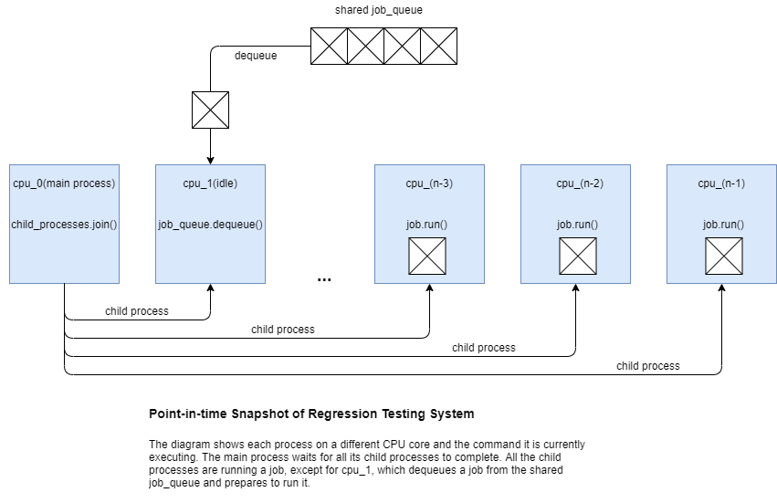
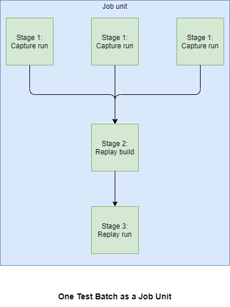

# ANGLE OpenGL Frame Capture and Replay

ANGLE currently supports a limited OpenGL capture and replay framework.

Limitations:

 * GLES capture has many unimplemented functions.
 * EGL capture and replay is not yet supported.
 * Mid-execution capture is supported with the Vulkan back-end.
 * Mid-execution capture has many unimplemented features.
 * Capture and replay is currently only tested on desktop platforms.
 * Binary replay is unimplemented. CPP replay is supported.

## Capturing and replaying an application

To build ANGLE with capture and replay enabled update your GN args:

```
angle_with_capture_by_default = true
```

Once built with capture enabled by default, ANGLE supports capturing OpenGL ES calls to CPP replay
files. To enable capture, set the `ANGLE_CAPTURE_FRAME_START` and `ANGLE_CAPTURE_FRAME_END`
environment variables to define a capture frame range, or use the [capture trigger
property][CaptureTrigger] on Android. By default the replay will be stored in the current working
directory. The capture files will be named according to the pattern
`angle_capture_context{id}_frame{n}.cpp`. Each GL Context currently has its own replay sources.
ANGLE will write out data binary blobs for large Texture or Buffer contents to
`angle_capture_context{id}_frame{n}.angledata`. Replay programs must be able to load data from the
corresponding `angledata` files.

## Controlling Frame Capture

Some simple environment variables control frame capture:

 * `ANGLE_CAPTURE_ENABLED`:
   * Set to `0` to disable capture entirely. Default is `1`.
 * `ANGLE_CAPTURE_COMPRESSION`:
   * Set to `0` to disable capture compression. Default is `1`.
 * `ANGLE_CAPTURE_OUT_DIR=<path>`:
   * Can specify an alternate replay output directory.
   * Example: `ANGLE_CAPTURE_OUT_DIR=samples/capture_replay`. Default is the CWD.
 * `ANGLE_CAPTURE_FRAME_START=<n>`:
   * Uses mid-execution capture to write "Setup" functions that starts a Context at frame `n`.
   * Example: `ANGLE_CAPTURE_FRAME_START=2`. Default is `0`.
 * `ANGLE_CAPTURE_FRAME_END=<n>`:
   * Example: `ANGLE_CAPTURE_FRAME_END=4`. Default is `0` which disables capture.
 * `ANGLE_CAPTURE_LABEL=<label>`:
   * When specified, files and functions will be labeled uniquely.
   * Example: `ANGLE_CAPTURE_LABEL=foo`
     * Results in filenames like this:
       ```
       foo.angledata.gz
       foo_context1_001.cpp
       foo_context1_002.cpp
       foo_context1_003.cpp
       foo_context1.cpp
       foo_context1.h
       foo.json
       foo_shared.cpp
       ...
       ```
 * `ANGLE_CAPTURE_SERIALIZE_STATE`:
   * Set to `1` to enable GL state serialization. Default is `0`.

A good way to test out the capture is to use environment variables in conjunction with the sample
template. For example:

```
$ ANGLE_CAPTURE_FRAME_END=4 ANGLE_CAPTURE_OUT_DIR=samples/capture_replay out/Debug/simple_texture_2d --use-angle=vulkan
```

## Running the capture_replay sample (desktop only)

To run a sample replay you can use a template located in
[samples/capture_replay](../samples/capture_replay). First run your sample and ensure all capture
files are written to `samples/capture_replay`. You can conveniently use `ANGLE_CAPTURE_OUT_DIR`.
Make sure `ANGLE_CAPTURE_LABEL` is left unset during capture to use the default file names.
Then enable the `capture_replay_sample` via `gn args`:

```
angle_build_capture_replay_sample = true
```

See [samples/BUILD.gn](../samples/BUILD.gn) for details. Then build and run your replay sample:

```
$ autoninja -C out/Debug capture_replay_sample
$ out/Debug/capture_replay_sample
```

## Running a perf test replay (all platforms, including Android)

To run your capture on any platform (Windows, Linux, Android, Mac (untested)), you'll need to
compile it as part of ANGLE's Trace Replay harness, which is part of `angle_perftests`.

Create a folder under `src/tests/restricted_traces` that matches the `ANGLE_CAPTURE_LABEL` you
used above.

Place all the trace output files into it.  For example, if the label was `desktop_test`:
```
src/tests/restricted_traces$ ls -1 desktop_test/
desktop_test.angledata.gz
desktop_test_context1_001.cpp
desktop_test_context1_002.cpp
desktop_test_context1_003.cpp
desktop_test_context1.cpp
desktop_test_context1.h
desktop_test.json
desktop_test_shared.cpp
```
Then add the label of your trace to
[restricted_traces.json](../src/tests/restricted_traces/restricted_traces.json).
Note it includes a version with the string.  Just use the number `1` for local changes.
```
     "dead_trigger_2 1",
+    "desktop_test 1",
     "disney_tsum_tsum 5",
```
Now you should be able to compile and run the perf test including your trace:
```
autoninja -C out/Debug angle_perftests
ANGLE_CAPTURE_ENABLED=0 out/Debug/angle_perftests --gtest_filter="*desktop_test*" --verbose
```
## Capturing an Android application

In order to capture on Android, the following additional steps must be taken. These steps
presume you've built and installed the ANGLE APK with capture enabled, and selected ANGLE
as the GLES driver for your application.

1. Create the output directory

    Determine your package name:
    ```
    export PACKAGE_NAME com.android.gl2jni
    ```
    Then create an output directory that it can write to:
    ```
    $ adb shell mkdir -p /sdcard/Android/data/$PACKAGE_NAME/angle_capture
    ```

2. Set properties to use for environment variable

    On Android, it is difficult to set an environment variable before starting native code.
    To work around this, ANGLE will read debug system properties before starting the capture
    and use them to prime environment variables used by the capture code.

    Note: Mid-execution capture doesn't work for Android just yet, so frame_start must be
    zero, which is the default. This it is sufficient to only set the end frame.
    ```
    $ adb shell setprop debug.angle.capture.frame_end 200
    ```

    There are other properties that can be set that match 1:1 with the env vars, but
    they are not required for capture:
    ```
    # Optional
    $ adb shell setprop debug.angle.capture.enabled 0
    $ adb shell setprop debug.angle.capture.out_dir foo
    $ adb shell setprop debug.angle.capture.frame_start 0
    $ adb shell setprop debug.angle.capture.label bar
    ```

3.  Run the application, then pull the files to the capture_replay directory
    ```
    $ cd samples/capture_replay
    $ adb pull /sdcard/Android/data/$PACKAGE_NAME/angle_capture replay_files
    $ cp replay_files/* .
    ```

4. Update your GN args to specifiy which context will be replayed.

    By default Context ID 1 will be replayed. On Android, Context ID 2 is more typical, some apps
    we've run go as high as ID 6.
    Note: this solution is temporary until EGL capture is in place.
    ```
    angle_capture_replay_sample_context_id = 2
    ```

5. Replay the capture on desktop

    Until we have samples building for Android, the replay sample must be run on desktop.
    We will also be plumbing replay files into perf and correctness tests which will run on Android.
    ```
    $ autoninja -C out/Release capture_replay_sample
    $ out/Release/capture_replay_sample
    ```

### Starting capture at an arbitrary frame
In some scenarios, you don't know which frame you want to start on. You'll only know when target
content is being rendered.  For that we've added a trigger that can allow starting the capture at
any time.

To use it, set the following environment variable, in addition to all the setup steps above. Set
the trigger value equal to the number of frames you'd like to capture.
```
adb shell setprop debug.angle.capture.trigger 20
```
When this value is set, `ANGLE_CAPTURE_FRAME_START` and `ANGLE_CAPTURE_FRAME_END` will be ignored.

While your content is rendering, wait until you arrive at the scene you'd like to capture. Then
set the value back to zero:
```
adb shell setprop debug.angle.capture.trigger 0
```
ANGLE will detect this change and start recording the requested number of frames.

## Testing

### Regression Testing Architecture
The [python script][link_to_python_script] uses the job queue pattern. We spawn n-1 independent
worker processes, where n is the value returned by multiprocessing.cpu_count(). Whenever a worker
process finishes a job and becomes available, it grabs the next job from a shared job queue and
runs that job on its CPU core. When there are no more jobs in the queue, the worker processes
terminate and the main process reports results.



### Job unit
A job unit is a test batch. Each test has to go through 3 stages: capture run, replay build, and
replay run. The test batch batches the replay build stage of multiple tests together, and the
replay run stage of multiple tests together.



### Running tests
From the command line, navigate to the ANGLE root folder [angle][angle_folder] then run the
command below:
```
python3 src/tests/capture_replay_tests.py --use-goma --gtest_filter=*/ES2_Vulkan --keep-temp-files --output-to-file --batch-count=8
```

* `--use-goma` to turn on/off building with goma
* `--gtest_filter` to run only specific tests
* `--keep-temp-files` to keep the trace files
* `--output-to-file` to write the log to results.txt at
 [src/tests/capture_replay_tests][capture_replay_test_folder] folder.
* `--batch-count` to set the number of tests in a batch. More tests in a batch means that
the tests will finish faster, but also means a lower level of granularity.
All command line arguments can be found at the top of the [python script][link_to_python_script].

[angle_folder]: ../
[capture_replay_test_folder]: ../src/tests/capture_replay_tests/
[link_to_python_script]: ../src/tests/capture_replay_tests.py
[CaptureTrigger]: ../src/tests/restricted_traces/README.md#trigger-the-capture
