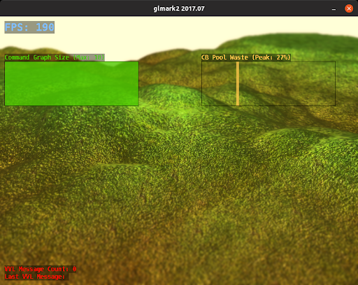

# Debug Overlay in ANGLE’s Vulkan Backend

## Motivation
A complex application has frequently changing performance characteristics due to
both a varying number of objects to draw and different effects that need to be
applied to them. When characterizing the performance of an application, it can
be easy to miss scenes which need optimization, especially if they are
ephemeral.

A debug overlay that shows on-the-fly statistics from the running application
can greatly aid the developer in finding where the bottlenecks are and which
scenes need further investigation and profiling.

ANGLE’s Vulkan debug overlay is drawn in a single compute pass for efficiency.
The initial implementation includes a few pieces of information for
demonstration purposes. Here’s the glmark2 *terrain* scene with these overlay
items enabled:



This is a screenshot of a debug build, hence the low FPS.
The command graph size is constant every frame.

## Implementation
Overlay items are of two fundamental types:
* Text items: A single line of text with small, medium or large font.
* Graph items: A bar graph of data. These each have a Text item attached
  that is automatically rendered with the graph item.

Built on these, various overlay item types are defined that gather statistics.
Five such types are defined with one item per type as example:
* **Count**: An item that counts something. **VulkanValidationMessageCount**
  is an overlay item of this type that shows the number of validation messages
  received from the validation layers.
* **Text**: A generic text widget. **VulkanLastValidationMessage** is an overlay
  item of this type that shows the last validation message.
* **PerSecond**: A value that gets reset every second automatically. **FPS** is
  an overlay item of this type that simply gets incremented on every `swap()`.
* **RunningGraph**: A graph of the last N values. **VulkanRenderPassCount** is an
  overlay of this type. This counter reports the number of RenderPasses rendered
  in each vkQueueSubmit call.
* **RunningHistogram**: A histogram of last N values. Input values are in the
  [0, 1] range and they are ranked to N buckets for histogram calculation.
  **VulkanSecondaryCommandBufferPoolWaste** is an overlay item of this type.
  On `vkQueueSubmit()`, the memory waste from command buffer pool allocations
  is recorded in the histogram.

Overlay font are placed in [libANGLE/overlay/](../src/libANGLE/overlay/)
which [gen_overlay_fonts.py](../src/libANGLE/gen_overlay_fonts.py) processes
to create an array of bits, which is processed at runtime to create
the actual font image (an image with 3 layers).

The overlay widget layout is defined in
[overlay_widgets.json](../src/libANGLE/overlay_widgets.json)
which [gen_overlay_widgets.py](../src/libANGLE/gen_overlay_widgets.py)
processes to generate an array of widgets, each of its respective type,
and sets their properties, such as color and bounding box.
The json file allows widgets to align against other widgets as well as against
the framebuffer edges. The following is a part of this file:
```json
{
    "name": "VulkanValidationMessageCount",
    "type": "Count",
    "color": [255, 0, 0, 255],
    "coords": [10, "VulkanLastValidationMessage.top.adjacent"],
    "font": "small",
    "length": 25
},
{
    "name": "VulkanSecondaryCommandBufferPoolWaste",
    "type": "RunningHistogram(50)",
    "color": [255, 200, 75, 200],
    "coords": [-50, 100],
    "bar_width": 6,
    "height": 100,
    "description": {
        "color": [255, 200, 75, 255],
        "coords": ["VulkanSecondaryCommandBufferPoolWaste.left.align",
                   "VulkanSecondaryCommandBufferPoolWaste.top.adjacent"],
        "font": "small",
        "length": 40
    }
}
```
Negative coordinates in this file indicate alignment to the right/bottom of the
framebuffer. `OtherItem.edge.mode` lets an item be aligned with another.
If `mode` is `align`, the item has the same origin as `OtherItem` and expands
in the same direction. If `adjacent`, the item expands in the opposite
direction.

Two compute shaders are implemented to efficiently render the UI:
* **OverlayCull**: This shader creates a bitset of Text and Graph items whose
  bounding boxes intersect a corresponding subgroup processed by OverlayDraw.
  This is done only when the enabled overlay items are changed or the surface
  is resized. This shader uses `subgroupBallot()` where possible, if not
  `subgroupOr()` where possible or otherwise shared buffers to create the bitset
  collaboratively.
* **OverlayDraw**: Using the bitsets generated by **OverlayCull**, values that
  are uniform for each workgroup (set to be equal to hardware subgroup size),
  this shader loops over enabled items that can possibly intersect the pixel
  being processed and renders and blends in texts and graphs. This is done once
  per frame on `present()`.

To build ANGLE with overlay capability, `angle_enable_overlay = true` must be
placed in `args.gn`.

Currently, to enable overlay items an environment variable is used. For example:

```commandline
$ export ANGLE_OVERLAY=FPS:VulkanSecondaryCommandBufferPoolWaste
$ ./hello_triangle --use-angle=vulkan
```

## Future Work
Possible future work
* On Android, add settings in developer options and enable items based on those.
* Spawn a small server in ANGLE and write an application that sends
  enable/disable commands remotely.
* Implement the Overlay rendering functionality in the front-end to benefit all
  backends.
* Add more overlay widgets.
* Implement automatic widget layout to remove the need to specify positions in the overlay widgets JSON.


