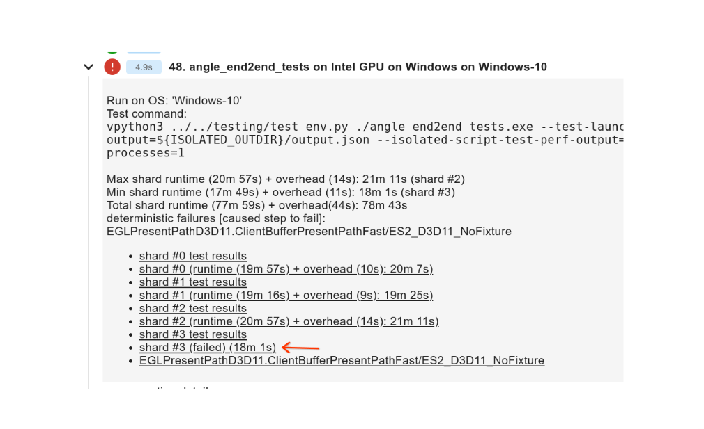
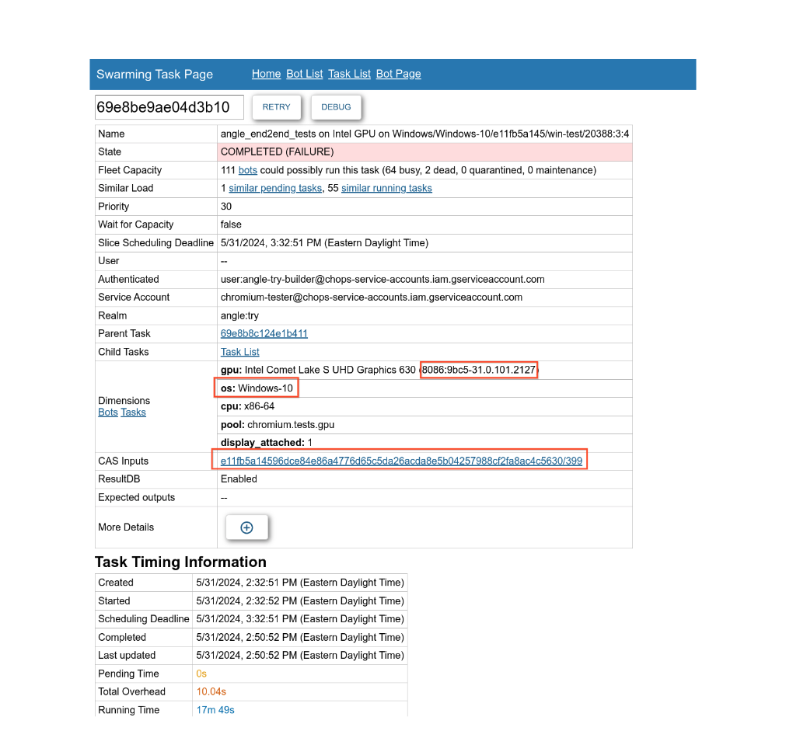
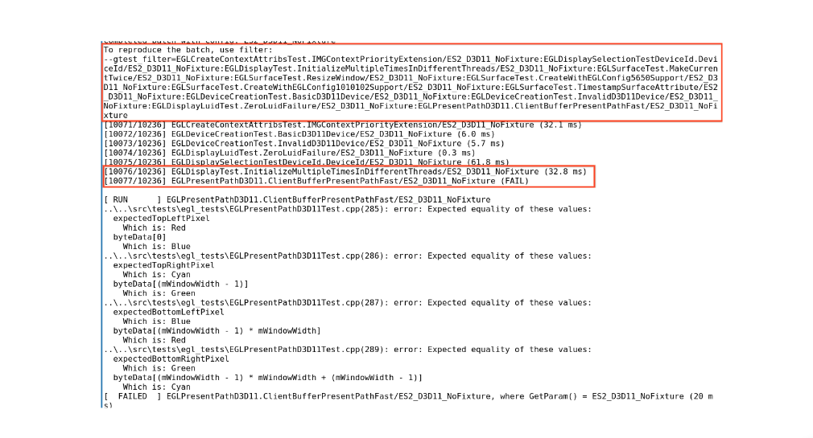

# Testing on bots

Sometimes a failure happens consistently (or flakily) on bots but is difficult to reproduce locally
due to a different platform, driver version, etc. The same build can be triggered on a matching bot
with additional arguments using the following steps. Triggering swarming tasks from a local build
can also sometimes be useful (see [`scripts/trigger.py`](../scripts/trigger.py)).

## Navigate to the shard



## Note the task dimensions as well as the "CAS inputs" identifier



* Task dimensions is a filter that limits which bots in the swarming pool will pick up the task. For
  example, here we can limit to the same OS and GPU with `-d os=Windows-10` and
  `-d gpu=8086:9bc5-31.0.101.2127` (note: this numeric GPU id encodes both the vendor and the
  specific driver version)

## Find additional args required to repro

The failure may or may not repro in isolation. Usually the test log will contain `--gtest_filter=`
with the batch that was used when the failure occurred:



* If not reproducible in isolation, it's usually easiest to start with the same batch to confirm the
  failure is reproduced and then trim the list down.

* Sometimes additional args are required (can be found in logs of the original task).

## Triggering a swarming task

You can trigger swarming tasks directly using `tools/luci-go/swarming trigger` from an ANGLE
checkout.

ACLs: ANGLE realm (e.g. `angle:try`) is guarded by
https://chrome-infra-auth.appspot.com/auth/groups/project-angle-owners. If that shows
`PermissionDenied`, you could also try `chromium:try`.

For example, trigger that reproduced the failure in the example above - filter had to include the
failing test and the test that ran right before it:

```
% tools/luci-go/swarming trigger \
  -digest=e11fb5a14596dce84e86a4776d65c5da26acda8e5b04257988cf2fa8ac4c5630/399 \
  -realm angle:try \
  -priority=20 \
  -server=https://chromium-swarm.appspot.com \
  -d os=Windows-10 \
  -d pool=chromium.tests.gpu \
  -d cpu=x86-64 \
  -d gpu=8086:9bc5-31.0.101.2127 \
  -service-account=chromium-tester@chops-service-accounts.iam.gserviceaccount.com \
  -env=ISOLATED_OUTDIR=\${ISOLATED_OUTDIR} \
  -relative-cwd=out/Release_x64 \
  -- vpython3 ../../testing/test_env.py \
  ./angle_end2end_tests.exe \
  --isolated-script-test-output=\${ISOLATED_OUTDIR}/output.json \
  --gtest_filter=EGLDisplayTest.InitializeMultipleTimesInDifferentThreads/ES2_D3D11_NoFixture:EGLPresentPathD3D11.ClientBufferPresentPathFast/ES2_D3D11_NoFixture
```

Additional notes:

* It occasionally matters that bots run with `--test-launcher-bot-mode` - this sets `mBotMode=true`
  in ANGLE harness and enables running multiple windows in parallel (however, on some bots
  multi-processing is deactivated due to flakes, in which case you can find `--max-processes` arg
  in the logs). Naturally, multiple windows are not supported on Android bots. If the failure
  you're investigating is on a platform which runs with multi-processing, you might want to try
  experimenting with these flags.

* See [`scripts/trigger.py`](../scripts/trigger.py) for triggering tasks from local builds - it
  first produces a CAS digest and then triggers a task using swarming trigger similar to the
  command above.

* CAS digests from bot builds can also be useful, e.g. by uploading a change and triggering a
  builder to get a build on a platform you may not have access to, or by taking a digest of a
  previous CI failure.

* `-relative-cwd` and binary can be figured out by clicking on "CAS inputs" and inspecting `out`;
  this can also be found in task logs.
