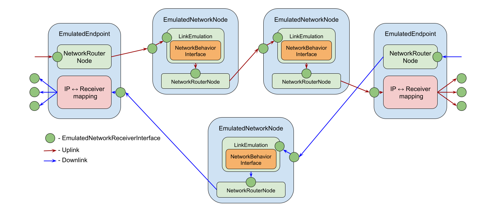
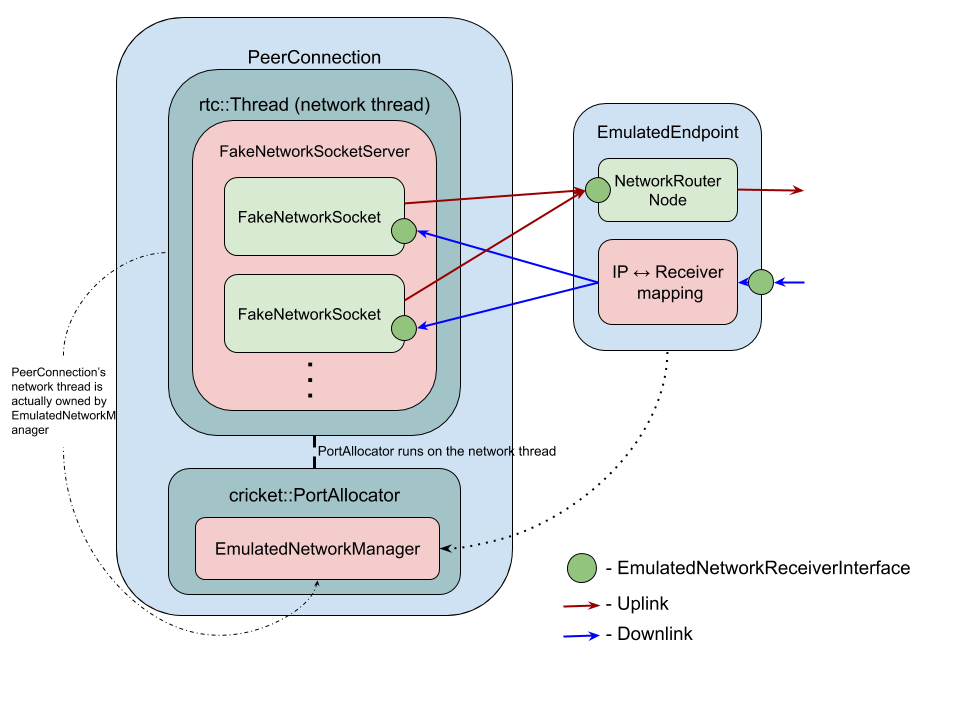

# Network Emulation Framework

<?% config.freshness.reviewed = '2021-03-01' %?>

[TOC]

## Disclamer

This documentation explain the implementation details of Network Emulation
Framework. Framework's public APIs are located in:

*   [`/api/test/network_emulation_manager.h`](https://source.chromium.org/search?q=%2Fapi%2Ftest%2Fnetwork_emulation_manager.h)
*   [`/api/test/create_network_emulation_manager.h`](https://source.chromium.org/search?q=%2Fapi%2Ftest%2Fcreate_network_emulation_manager.h)
*   [`/api/test/network_emulation/network_emulation_interfaces.h`](https://source.chromium.org/search?q=%2Fapi%2Ftest%2Fnetwork_emulation%2Fnetwork_emulation_interfaces.h)
*   [`/api/test/simulated_network.h`](https://source.chromium.org/search?q=%2Fapi%2Ftest%2Fsimulated_network.h)

## Overview

Network Emulation Framework provides an ability to emulate network behavior
between different clients, including a WebRTC PeerConnection client. To
configure network behavior, the user can choose different options:

*   Use predefined implementation that can be configured with parameters such as
    packet loss, bandwidth, delay, etc.
*   Custom implementation

Conceptually the framework provides the ability to define multiple endpoints and
routes used to connect them. All network related entities are created and
managed by single factory class `webrtc::NetworkEmulationManager` which is
implemented by `webrtc::test::NetworkEmulationManagerImpl` and can work in two
modes:

*   Real time
*   Simulated time

The manager has a dedicated task queue which pipes all packets through all
network routes from senders to receivers. This task queue behaviour is
determined by `webrtc::TimeController`, which is based on either in real time or
simulated time mode.

The network operates on IP level and supports only UDP for now.

## Abstractions

The framework contains the following public abstractions:

*   `webrtc::NetworkBehaviorInterface` - defines how emulated network should
    behave. It operates on packets metadata level and is responsible for telling
    which packet at which time have to be delivered to the next receiver.

*   `webrtc::EmulatedIpPacket` - represents a single packet that can be sent or
    received via emulated network. It has source and destination address and
    payload to transfer.

*   `webrtc::EmulatedNetworkReceiverInterface` - generic packet receiver
    interface.

*   `webrtc::EmulatedEndpoint` - primary user facing abstraction of the
    framework. It represents a network interface on client's machine. It has its
    own unique IP address and can be used to send and receive packets.

    `EmulatedEndpoint` implements `EmulatedNetworkReceiverInterface` to receive
    packets from the network and provides an API to send packets to the network
    and API to bind other `EmulatedNetworkReceiverInterface` which will be able
    to receive packets from the endpoint. `EmulatedEndpoint` interface has the
    only implementation: `webrtc::test::EmulatedEndpointImpl`.

*   `webrtc::EmulatedNetworkNode` - represents single network in the real world,
    like a 3G network between peers, or Wi-Fi for one peer and LTE for another.
    Each `EmulatedNetworkNode` is a single direction connetion and to form
    bidirectional connection between endpoints two nodes should be used.
    Multiple nodes can be joined into chain emulating a network path from one
    peer to another.

    In public API this class is forward declared and fully accessible only by
    the framework implementation.

    Internally consist of two parts: `LinkEmulation`, which is responsible for
    behavior of current `EmulatedNetworkNode` and `NetworkRouterNode` which is
    responsible for routing packets to the next node or to the endpoint.

*   `webrtc::EmulatedRoute` - represents single route from one network interface
    on one device to another network interface on another device.

    In public API this class is forward declared and fully accessible only by
    the framework implementation.

    It contains start and end endpoint and ordered list of `EmulatedNetworkNode`
    which forms the single directional route between those endpoints.

The framework has also the following private abstractions:

*   `webrtc::test::NetworkRouterNode` - an `EmulatedNetworkReceiverInterface`
    that can route incoming packets to the next receiver based on internal IP
    routing table.

*   `webrtc::test::LinkEmulation` - an `EmulatedNetworkReceiverInterface` that
    can emulate network leg behavior via `webrtc::NetworkBehaviorInterface`
    interface.

For integrating with `webrtc::PeerConnection` there are helper abstractions:

*   `webrtc::EmulatedNetworkManagerInterface` which is implemented by
    `webrtc::test::EmulatedNetworkManager` and provides `rtc::Thread` and
    `rtc::NetworkManager` for WebRTC to use as network thread for
    `PeerConnection` and for `cricket::BasicPortAllocator`.

    Implementation represent framework endpoints as `rtc::Network` to WebRTC.

## Architecture

Let's take a look on how framework's abstractions are connected to each other.

When the user wants to setup emulated network, first of all, they should create
an instance of `NetworkEmulationManager` using
`webrtc::CreateNetworkEmulationManager(...)` API. Then user should use a manager
to create at least one `EmulatedEndpoint` for each client. After endpoints, the
user should create required `EmulatedNetworkNode`s and with help of manager
chain them into `EmulatedRoute`s conecting desired endpoints.

Here is a visual overview of the emulated network architecture:

When network is hooked into `PeerConnection` it is done through network thread
and `NetworkManager`. In the network thread the custom `rtc::SocketServer` is
provided: `webrtc::test::FakeNetworkSocketServer`. This custom socket server
will construct custom sockets (`webrtc::test::FakeNetworkSocket`), which
internally bind themselves to the required endpoint. All packets processing
inside socket have to be done on the `PeerConnection`'s network thread. When
packet is going from `PeerConnection` to the network it's already comming from
the network thread and when it's comming from the emulated network switch from
the Network Emulation Framework internal task queue and `PeerConnection`'s
network thread is done inside socket's `OnPacketReceived(...)` method.

