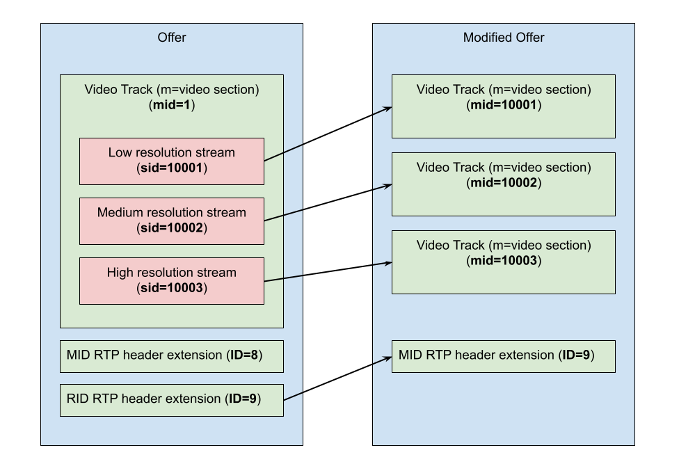

<?% config.freshness.reviewed = '2021-04-12' %?>

# PeerConnection level framework fixture architecture

## Overview

The main implementation of
[`webrtc::webrtc_pc_e2e::PeerConnectionE2EQualityTestFixture`][1] is
[`webrtc::webrtc_pc_e2e::PeerConnectionE2EQualityTest`][2]. Internally it owns
the next main pieces:

*   [`MediaHelper`][3] - responsible for adding audio and video tracks to the
    peers.
*   [`VideoQualityAnalyzerInjectionHelper`][4] and
    [`SingleProcessEncodedImageDataInjector`][5] - used to inject video quality
    analysis and properly match captured and rendered video frames. You can read
    more about it in
    [DefaultVideoQualityAnalyzer](default_video_quality_analyzer.md) section.
*   [`AudioQualityAnalyzerInterface`][6] - used to measure audio quality metrics
*   [`TestActivitiesExecutor`][7] - used to support [`ExecuteAt(...)`][8] and
    [`ExecuteEvery(...)`][9] API of `PeerConnectionE2EQualityTestFixture` to run
    any arbitrary action during test execution timely synchronized with a test
    call.
*   A vector of [`QualityMetricsReporter`][10] added by the
    `PeerConnectionE2EQualityTestFixture` user.
*   Two peers: Alice and Bob represented by instances of [`TestPeer`][11]
    object.

Also it keeps a reference to [`webrtc::TimeController`][12], which is used to
create all required threads, task queues, task queue factories and time related
objects.

## TestPeer

Call participants are represented by instances of `TestPeer` object.
[`TestPeerFactory`][13] is used to create them. `TestPeer` owns all instances
related to the `webrtc::PeerConnection`, including required listeners and
callbacks. Also it provides an API to do offer/answer exchange and ICE candidate
exchange. For this purposes internally it uses an instance of
[`webrtc::PeerConnectionWrapper`][14].

The `TestPeer` also owns the `PeerConnection` worker thread. The signaling
thread for all `PeerConnection`'s is owned by
`PeerConnectionE2EQualityTestFixture` and shared between all participants in the
call. The network thread is owned by the network layer (it maybe either emulated
network provided by [Network Emulation Framework][24] or network thread and
`rtc::NetworkManager` provided by user) and provided when peer is added to the
fixture via [`AddPeer(...)`][15] API.

## GetStats API based metrics reporters

`PeerConnectionE2EQualityTestFixture` gives the user ability to provide
different `QualityMetricsReporter`s which will listen for `PeerConnection`
[`GetStats`][16] API. Then such reporters will be able to report various metrics
that user wants to measure.

`PeerConnectionE2EQualityTestFixture` itself also uses this mechanism to
measure:

*   Audio quality metrics
*   Audio/Video sync metrics (with help of [`CrossMediaMetricsReporter`][17])

Also framework provides a [`StatsBasedNetworkQualityMetricsReporter`][18] to
measure network related WebRTC metrics and print debug raw emulated network
statistic. This reporter should be added by user via
[`AddQualityMetricsReporter(...)`][19] API if requried.

Internally stats gathering is done by [`StatsPoller`][20]. Stats are requested
once per second for each `PeerConnection` and then resulted object is provided
into each stats listener.

## Offer/Answer exchange

`PeerConnectionE2EQualityTest` provides ability to test Simulcast and SVC for
video. These features aren't supported by P2P call and in general requires a
Selective Forwarding Unit (SFU). So special logic is applied to mimic SFU
behavior in P2P call. This logic is located inside [`SignalingInterceptor`][21],
[`QualityAnalyzingVideoEncoder`][22] and [`QualityAnalyzingVideoDecoder`][23]
and consist of SDP modification during offer/answer exchange and special
handling of video frames from unrelated Simulcast/SVC streams during decoding.

### Simulcast

In case of Simulcast we have a video track, which internally contains multiple
video streams, for example low resolution, medium resolution and high
resolution. WebRTC client doesn't support receiving an offer with multiple
streams in it, because usually SFU will keep only single stream for the client.
To bypass it framework will modify offer by converting a single track with three
video streams into three independent video tracks. Then sender will think that
it send simulcast, but receiver will think that it receives 3 independent
tracks.

To achieve such behavior some extra tweaks are required:

*   MID RTP header extension from original offer have to be removed
*   RID RTP header extension from original offer is replaced with MID RTP header
    extension, so the ID that sender uses for RID on receiver will be parsed as
    MID.
*   Answer have to be modified in the opposite way.

Described modifications are illustrated on the picture below.



The exchange will look like this:

1.  Alice creates an offer
2.  Alice sets offer as local description
3.  Do described offer modification
4.  Alice sends modified offer to Bob
5.  Bob sets modified offer as remote description
6.  Bob creates answer
7.  Bob sets answer as local description
8.  Do reverse modifications on answer
9.  Bob sends modified answer to Alice
10. Alice sets modified answer as remote description

Such mechanism put a constraint that RTX streams are not supported, because they
don't have RID RTP header extension in their packets.

### SVC

In case of SVC the framework will update the sender's offer before even setting
it as local description on the sender side. Then no changes to answer will be
required.

`ssrc` is a 32 bit random value that is generated in RTP to denote a specific
source used to send media in an RTP connection. In original offer video track
section will look like this:

```
m=video 9 UDP/TLS/RTP/SAVPF 98 100 99 101
...
a=ssrc-group:FID <primary ssrc> <retransmission ssrc>
a=ssrc:<primary ssrc> cname:...
....
a=ssrc:<retransmission ssrc> cname:...
....
```

To enable SVC for such video track framework will add extra `ssrc`s for each SVC
stream that is required like this:

```
a=ssrc-group:FID <Low resolution primary ssrc> <Low resolution retransmission ssrc>
a=ssrc:<Low resolution primary ssrc> cname:...
....
a=ssrc:<Low resolution retransmission ssrc> cname:....
...
a=ssrc-group:FID <Medium resolution primary ssrc> <Medium resolution retransmission ssrc>
a=ssrc:<Medium resolution primary ssrc> cname:...
....
a=ssrc:<Medium resolution retransmission ssrc> cname:....
...
a=ssrc-group:FID <High resolution primary ssrc> <High resolution retransmission ssrc>
a=ssrc:<High resolution primary ssrc> cname:...
....
a=ssrc:<High resolution retransmission ssrc> cname:....
...
```

The next line will also be added to the video track section of the offer:

```
a=ssrc-group:SIM <Low resolution primary ssrc> <Medium resolution primary ssrc> <High resolution primary ssrc>
```

It will tell PeerConnection that this track should be configured as SVC. It
utilize WebRTC Plan B offer structure to achieve SVC behavior, also it modifies
offer before setting it as local description which violates WebRTC standard.
Also it adds limitations that on lossy networks only top resolution streams can
be analyzed, because WebRTC won't try to restore low resolution streams in case
of loss, because it still receives higher stream.

### Handling in encoder/decoder

In the encoder, the framework for each encoded video frame will propagate
information requried for the fake SFU to know if it belongs to an interesting
simulcast stream/spatial layer of if it should be "discarded".

On the decoder side frames that should be "discarded" by fake SFU will be auto
decoded into single pixel images and only the interesting simulcast
stream/spatial layer will go into real decoder and then will be analyzed.

[1]: https://source.chromium.org/chromium/chromium/src/+/main:third_party/webrtc/api/test/peerconnection_quality_test_fixture.h;l=55;drc=484acf27231d931dbc99aedce85bc27e06486b96
[2]: https://source.chromium.org/chromium/chromium/src/+/main:third_party/webrtc/test/pc/e2e/peer_connection_quality_test.h;l=44;drc=6cc893ad778a0965e2b7a8e614f3c98aa81bee5b
[3]: https://source.chromium.org/chromium/chromium/src/+/main:third_party/webrtc/test/pc/e2e/media/media_helper.h;l=27;drc=d46db9f1523ae45909b4a6fdc90a140443068bc6
[4]: https://source.chromium.org/chromium/chromium/src/+/main:third_party/webrtc/test/pc/e2e/analyzer/video/video_quality_analyzer_injection_helper.h;l=38;drc=79020414fd5c71f9ec1f25445ea5f1c8001e1a49
[5]: https://source.chromium.org/chromium/chromium/src/+/main:third_party/webrtc/test/pc/e2e/analyzer/video/single_process_encoded_image_data_injector.h;l=40;drc=79020414fd5c71f9ec1f25445ea5f1c8001e1a49
[6]: https://source.chromium.org/chromium/chromium/src/+/main:third_party/webrtc/api/test/audio_quality_analyzer_interface.h;l=23;drc=20f45823e37fd7272aa841831c029c21f29742c2
[7]: https://source.chromium.org/chromium/chromium/src/+/main:third_party/webrtc/test/pc/e2e/test_activities_executor.h;l=28;drc=6cc893ad778a0965e2b7a8e614f3c98aa81bee5b
[8]: https://source.chromium.org/chromium/chromium/src/+/main:third_party/webrtc/api/test/peerconnection_quality_test_fixture.h;l=439;drc=484acf27231d931dbc99aedce85bc27e06486b96
[9]: https://source.chromium.org/chromium/chromium/src/+/main:third_party/webrtc/api/test/peerconnection_quality_test_fixture.h;l=445;drc=484acf27231d931dbc99aedce85bc27e06486b96
[10]: https://source.chromium.org/chromium/chromium/src/+/main:third_party/webrtc/api/test/peerconnection_quality_test_fixture.h;l=413;drc=9438fb3fff97c803d1ead34c0e4f223db168526f
[11]: https://source.chromium.org/chromium/chromium/src/+/main:third_party/webrtc/test/pc/e2e/test_activities_executor.h;l=28;drc=6cc893ad778a0965e2b7a8e614f3c98aa81bee5b
[12]: https://source.chromium.org/chromium/chromium/src/+/main:third_party/webrtc/test/pc/e2e/test_activities_executor.h;l=28;drc=6cc893ad778a0965e2b7a8e614f3c98aa81bee5b
[13]: https://source.chromium.org/chromium/chromium/src/+/main:third_party/webrtc/test/pc/e2e/test_peer_factory.h;l=46;drc=0ef4a2488a466a24ab97b31fdddde55440d451f9
[14]: https://source.chromium.org/chromium/chromium/src/+/main:third_party/webrtc/pc/peer_connection_wrapper.h;l=47;drc=5ab79e62f691875a237ea28ca3975ea1f0ed62ec
[15]: https://source.chromium.org/chromium/chromium/src/+/main:third_party/webrtc/api/test/peerconnection_quality_test_fixture.h;l=459;drc=484acf27231d931dbc99aedce85bc27e06486b96
[16]: https://source.chromium.org/chromium/chromium/src/+/main:third_party/webrtc/api/peer_connection_interface.h;l=886;drc=9438fb3fff97c803d1ead34c0e4f223db168526f
[17]: https://source.chromium.org/chromium/chromium/src/+/main:third_party/webrtc/test/pc/e2e/cross_media_metrics_reporter.h;l=29;drc=9d777620236ec76754cfce19f6e82dd18e52d22c
[18]: https://source.chromium.org/chromium/chromium/src/+/main:third_party/webrtc/test/pc/e2e/cross_media_metrics_reporter.h;l=29;drc=9d777620236ec76754cfce19f6e82dd18e52d22c
[19]: https://source.chromium.org/chromium/chromium/src/+/main:third_party/webrtc/api/test/peerconnection_quality_test_fixture.h;l=450;drc=484acf27231d931dbc99aedce85bc27e06486b96
[20]: https://source.chromium.org/chromium/chromium/src/+/main:third_party/webrtc/test/pc/e2e/stats_poller.h;l=52;drc=9b526180c9e9722d3fc7f8689da6ec094fc7fc0a
[21]: https://source.chromium.org/chromium/chromium/src/+/main:third_party/webrtc/test/pc/e2e/sdp/sdp_changer.h;l=79;drc=ee558dcca89fd8b105114ededf9e74d948da85e8
[22]: https://source.chromium.org/chromium/chromium/src/+/main:third_party/webrtc/test/pc/e2e/analyzer/video/quality_analyzing_video_encoder.h;l=54;drc=79020414fd5c71f9ec1f25445ea5f1c8001e1a49
[23]: https://source.chromium.org/chromium/chromium/src/+/main:third_party/webrtc/test/pc/e2e/analyzer/video/quality_analyzing_video_decoder.h;l=50;drc=79020414fd5c71f9ec1f25445ea5f1c8001e1a49
[24]: /test/network/g3doc/index.md
