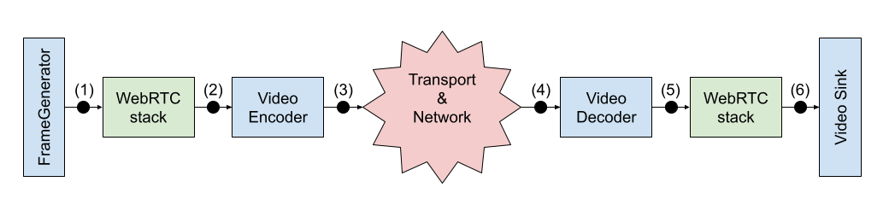
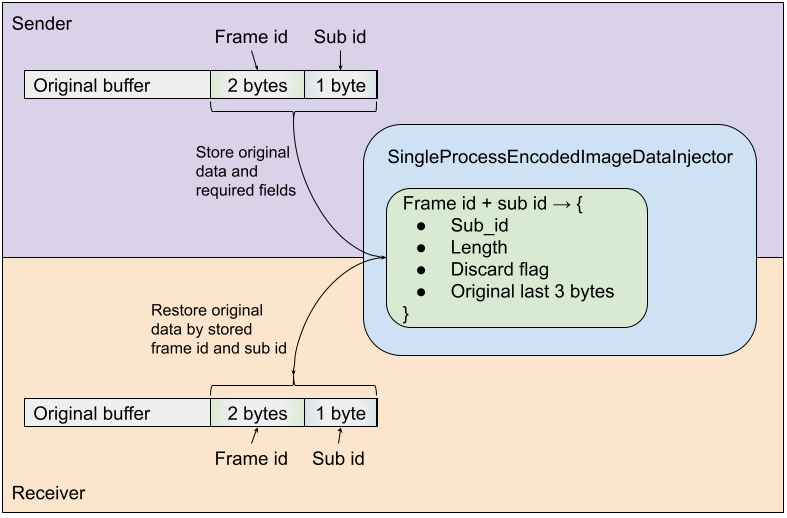

<?% config.freshness.reviewed = '2021-02-21' %?>

# DefaultVideoQualityAnalyzer

## Audience

This document is for users of
[`webrtc::webrtc_pc_e2e::DefaultVideoQualityAnalyzer`][1].

## Overview

`DefaultVideoQualityAnalyzer` implements
[`webrtc::VideoQualityAnalyzerInterface`][2] and is a main
implementation of video quality analyzer for WebRTC. To operate correctly it
requires to receive video frame on each step:

1.  On frame captured - analyzer will generate a unique ID for the frame, that
    caller should attach to the it.
2.  Immediately before frame enter the encoder.
3.  Immediately after the frame was encoded.
4.  After the frame was received and immediately before it entered the decoder.
5.  Immediately after the frame was decoded.
6.  When the frame was rendered.

The analyzer updates its internal metrics per frame when it was rendered and
reports all of them after it was stopped through
[WebRTC perf results reporting system][10].

To properly inject `DefaultVideoQualityAnalyzer` into pipeline the following helpers can be used:

### VideoQualityAnalyzerInjectionHelper

[`webrtc::webrtc_pc_e2e::VideoQualityAnalyzerInjectionHelper`][3] provides
factory methods for components, that will be used to inject
`VideoQualityAnalyzerInterface` into the `PeerConnection` pipeline:

*   Wrappers for [`webrtc::VideoEncoderFactory`][4] and
    [`webrtc::VideoDecodeFactory`][5] which will properly pass
    [`webrtc::VideoFrame`][6] and [`webrtc::EncodedImage`][7] into analyzer
    before and after real video encode and decoder.
*   [`webrtc::test::TestVideoCapturer::FramePreprocessor`][8] which is used to
    pass generated frames into analyzer on capturing and then set the returned
    frame ID. It also configures dumping of captured frames if requried.
*   [`rtc::VideoSinkInterface<VideoFrame>`][9] which is used to pass frames to
    the analyzer before they will be rendered to compute per frame metrics. It
    also configures dumping of rendered video if requried.

Besides factories `VideoQualityAnalyzerInjectionHelper` has method to
orchestrate `VideoQualityAnalyzerInterface` workflow:

*   `Start` - to start video analyzer, so it will be able to receive and analyze
    video frames.
*   `RegisterParticipantInCall` - to add new participants after analyzer was
    started.
*   `Stop` - to stop analyzer, compute all metrics for frames that were recevied
    before and report them.

Also `VideoQualityAnalyzerInjectionHelper` implements
[`webrtc::webrtc_pc_e2e::StatsObserverInterface`][11] to propagate WebRTC stats
to `VideoQualityAnalyzerInterface`.

### EncodedImageDataInjector and EncodedImageDataExtractor

[`webrtc::webrtc_pc_e2e::EncodedImageDataInjector`][14] and
[`webrtc::webrtc_pc_e2e::EncodedImageDataInjector`][15] are used to inject and
extract data into `webrtc::EncodedImage` to propagate frame ID and other
required information through the network.

By default [`webrtc::webrtc_pc_e2e::SingleProcessEncodedImageDataInjector`][16]
is used. It assumes `webrtc::EncodedImage` payload as black box which is
remaining unchanged from encoder to decoder and stores the information required
for its work in the last 3 bytes of the payload, replacing the original data
during injection and restoring it back during extraction. Also
`SingleProcessEncodedImageDataInjector` requires that sender and receiver were
inside single process.

## Exported metrics

Exported metrics are reported to WebRTC perf results reporting system.

### General

*   *`cpu_usage`* - CPU usage excluding video analyzer

### Video

*   *`psnr`* - peak signal-to-noise ratio:
    [wikipedia](https://en.wikipedia.org/wiki/Peak_signal-to-noise_ratio)
*   *`ssim`* - structural similarity:
    [wikipedia](https://en.wikipedia.org/wiki/Structural_similarity).
*   *`min_psnr`* - minimum value of psnr across all frames of video stream.
*   *`encode_time`* - time to encode a single frame.
*   *`decode_time`* - time to decode a single frame.
*   *`transport_time`* - time from frame encoded to frame received for decoding.
*   *`receive_to_render_time`* - time from frame received for decoding to frame
    rendered.
*   *`total_delay_incl_transport`* - time from frame was captured on device to
    time when frame was displayed on device.
*   *`encode_frame_rate`* - frame rate after encoder.
*   *`harmonic_framerate`* - video duration divided on squared sum of interframe
    delays. Reflects render frame rate penalized by freezes.
*   *`time_between_rendered_frames`* - time between frames out to renderer.
*   *`dropped_frames`* - amount of frames that were sent, but weren't rendered
    and are known not to be “on the way” from sender to receiver.

Freeze is a pause when no new frames from decoder arrived for 150ms + avg time
between frames or 3 * avg time between frames.

*   *`time_between_freezes`* - mean time from previous freeze end to new freeze
    start.
*   *`freeze_time_ms`* - total freeze time in ms.
*   *`max_skipped`* - frames skipped between two nearest rendered.
*   *`pixels_per_frame`* - amount of pixels on frame (width * height).
*   *`target_encode_bitrate`* - target encode bitrate provided by BWE to
    encoder.
*   *`actual_encode_bitrate -`* - actual encode bitrate produced by encoder.
*   *`available_send_bandwidth -`* - available send bandwidth estimated by BWE.
*   *`transmission_bitrate`* - bitrate of media in the emulated network, not
    counting retransmissions FEC, and RTCP messages
*   *`retransmission_bitrate`* - bitrate of retransmission streams only.

### Framework stability

*   *`frames_in_flight`* - amount of frames that were captured but wasn't seen
    on receiver.

## Debug metrics

Debug metrics are not reported to WebRTC perf results reporting system, but are
available through `DefaultVideoQualityAnalyzer` API.

### [FrameCounters][12]

Frame counters consist of next counters:

*   *`captured`* - count of frames, that were passed into WebRTC pipeline by
    video stream source
*   *`pre_encoded`* - count of frames that reached video encoder.
*   *`encoded`* - count of encoded images that were produced by encoder for all
    requested spatial layers and simulcast streams.
*   *`received`* - count of encoded images received in decoder for all requested
    spatial layers and simulcast streams.
*   *`decoded`* - count of frames that were produced by decoder.
*   *`rendered`* - count of frames that went out from WebRTC pipeline to video
    sink.
*   *`dropped`* - count of frames that were dropped in any point between
    capturing and rendering.

`DefaultVideoQualityAnalyzer` exports these frame counters:

*   *`GlobalCounters`* - frame counters for frames met on each stage of analysis
    for all media streams.
*   *`PerStreamCounters`* - frame counters for frames met on each stage of
    analysis separated per individual video track (single media section in the
    SDP offer).

### [AnalyzerStats][13]

Contains metrics about internal state of video analyzer during its work

*   *`comparisons_queue_size`* - size of analyzer internal queue used to perform
    captured and rendered frames comparisons measured when new element is added
    to the queue.
*   *`comparisons_done`* - number of performed comparisons of 2 video frames
    from captured and rendered streams.
*   *`cpu_overloaded_comparisons_done`* - number of cpu overloaded comparisons.
    Comparison is cpu overloaded if it is queued when there are too many not
    processed comparisons in the queue. Overloaded comparison doesn't include
    metrics like SSIM and PSNR that require heavy computations.
*   *`memory_overloaded_comparisons_done`* - number of memory overloaded
    comparisons. Comparison is memory overloaded if it is queued when its
    captured frame was already removed due to high memory usage for that video
    stream.
*   *`frames_in_flight_left_count`* - count of frames in flight in analyzer
    measured when new comparison is added and after analyzer was stopped.

[1]: https://source.chromium.org/chromium/chromium/src/+/master:third_party/webrtc/test/pc/e2e/analyzer/video/default_video_quality_analyzer.h;l=188;drc=08f46909a8735cf181b99ef2f7e1791c5a7531d2
[2]: https://source.chromium.org/chromium/chromium/src/+/master:third_party/webrtc/api/test/video_quality_analyzer_interface.h;l=56;drc=d7808f1c464a07c8f1e2f97ec7ee92fda998d590
[3]: https://source.chromium.org/chromium/chromium/src/+/master:third_party/webrtc/test/pc/e2e/analyzer/video/video_quality_analyzer_injection_helper.h;l=39;drc=08f46909a8735cf181b99ef2f7e1791c5a7531d2
[4]: https://source.chromium.org/chromium/chromium/src/+/master:third_party/webrtc/api/video_codecs/video_encoder_factory.h;l=27;drc=08f46909a8735cf181b99ef2f7e1791c5a7531d2
[5]: https://source.chromium.org/chromium/chromium/src/+/master:third_party/webrtc/api/video_codecs/video_decoder_factory.h;l=27;drc=08f46909a8735cf181b99ef2f7e1791c5a7531d2
[6]: https://source.chromium.org/chromium/chromium/src/+/master:third_party/webrtc/api/video/video_frame.h;l=30;drc=08f46909a8735cf181b99ef2f7e1791c5a7531d2
[7]: https://source.chromium.org/chromium/chromium/src/+/master:third_party/webrtc/api/video/encoded_image.h;l=71;drc=08f46909a8735cf181b99ef2f7e1791c5a7531d2
[8]: https://source.chromium.org/chromium/chromium/src/+/master:third_party/webrtc/test/test_video_capturer.h;l=28;drc=08f46909a8735cf181b99ef2f7e1791c5a7531d2
[9]: https://source.chromium.org/chromium/chromium/src/+/master:third_party/webrtc/api/video/video_sink_interface.h;l=19;drc=08f46909a8735cf181b99ef2f7e1791c5a7531d2
[10]: https://source.chromium.org/chromium/chromium/src/+/master:third_party/webrtc/test/testsupport/perf_test.h;drc=0710b401b1e5b500b8e84946fb657656ba1b58b7
[11]: https://source.chromium.org/chromium/chromium/src/+/master:third_party/webrtc/api/test/stats_observer_interface.h;l=21;drc=9b526180c9e9722d3fc7f8689da6ec094fc7fc0a
[12]: https://source.chromium.org/chromium/chromium/src/+/master:third_party/webrtc/test/pc/e2e/analyzer/video/default_video_quality_analyzer.h;l=57;drc=08f46909a8735cf181b99ef2f7e1791c5a7531d2
[13]: https://source.chromium.org/chromium/chromium/src/+/master:third_party/webrtc/test/pc/e2e/analyzer/video/default_video_quality_analyzer.h;l=113;drc=08f46909a8735cf181b99ef2f7e1791c5a7531d2
[14]: https://source.chromium.org/chromium/chromium/src/+/master:third_party/webrtc/test/pc/e2e/analyzer/video/encoded_image_data_injector.h;l=23;drc=c57089a97a3df454f4356d882cc8df173e8b3ead
[15]: https://source.chromium.org/chromium/chromium/src/+/master:third_party/webrtc/test/pc/e2e/analyzer/video/encoded_image_data_injector.h;l=46;drc=c57089a97a3df454f4356d882cc8df173e8b3ead
[16]: https://source.chromium.org/chromium/chromium/src/+/master:third_party/webrtc/test/pc/e2e/analyzer/video/single_process_encoded_image_data_injector.h;l=40;drc=c57089a97a3df454f4356d882cc8df173e8b3ead
