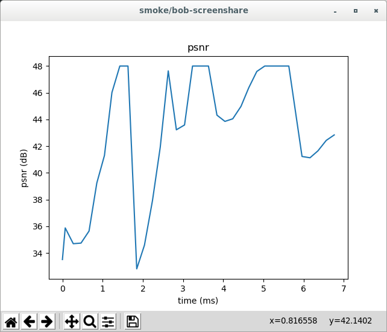

<?% config.freshness.reviewed = '2021-04-12' %?>

# PeerConnection Level Framework

## API

*   [Fixture][1]
*   [Fixture factory function][2]

## Documentation

The PeerConnection level framework is designed for end-to-end media quality
testing through the PeerConnection level public API. The framework uses the
*Unified plan* API to generate offers/answers during the signaling phase. The
framework also wraps the video encoder/decoder and inject it into
*`webrtc::PeerConnection`* to measure video quality, performing 1:1 frames
matching between captured and rendered frames without any extra requirements to
input video. For audio quality evaluation the standard `GetStats()` API from
PeerConnection is used.

The framework API is located in the namespace *`webrtc::webrtc_pc_e2e`*.

### Supported features

*   Single or bidirectional media in the call
*   RTC Event log dump per peer
*   AEC dump per peer
*   Compatible with *`webrtc::TimeController`* for both real and simulated time
*   Media
    *   AV sync
*   Video
    *   Any amount of video tracks both from caller and callee sides
    *   Input video from
        *   Video generator
        *   Specified file
        *   Any instance of *`webrtc::test::FrameGeneratorInterface`*
    *   Dumping of captured/rendered video into file
    *   Screen sharing
    *   Vp8 simulcast from caller side
    *   Vp9 SVC from caller side
    *   Choosing of video codec (name and parameters), having multiple codecs
        negotiated to support codec-switching testing.
    *   FEC (ULP or Flex)
    *   Forced codec overshooting (for encoder overshoot emulation on some
        mobile devices, when hardware encoder can overshoot target bitrate)
*   Audio
    *   Up to 1 audio track both from caller and callee sides
    *   Generated audio
    *   Audio from specified file
    *   Dumping of captured/rendered audio into file
    *   Parameterizing of `cricket::AudioOptions`
    *   Echo emulation
*   Injection of various WebRTC components into underlying
    *`webrtc::PeerConnection`* or *`webrtc::PeerConnectionFactory`*. You can see
    the full list [here][11]
*   Scheduling of events, that can happen during the test, for example:
    *   Changes in network configuration
    *   User statistics measurements
    *   Custom defined actions
*   User defined statistics reporting via
    *`webrtc::webrtc_pc_e2e::PeerConnectionE2EQualityTestFixture::QualityMetricsReporter`*
    interface

## Exported metrics

### General

*   *`<peer_name>_connected`* - peer successfully established connection to
    remote side
*   *`cpu_usage`* - CPU usage excluding video analyzer
*   *`audio_ahead_ms`* - Used to estimate how much audio and video is out of
    sync when the two tracks were from the same source. Stats are polled
    periodically during a call. The metric represents how much earlier was audio
    played out on average over the call. If, during a stats poll, video is
    ahead, then audio_ahead_ms will be equal to 0 for this poll.
*   *`video_ahead_ms`* - Used to estimate how much audio and video is out of
    sync when the two tracks were from the same source. Stats are polled
    periodically during a call. The metric represents how much earlier was video
    played out on average over the call. If, during a stats poll, audio is
    ahead, then video_ahead_ms will be equal to 0 for this poll.

### Video

See documentation for
[*`DefaultVideoQualityAnalyzer`*](default_video_quality_analyzer.md#exported-metrics)

### Audio

*   *`accelerate_rate`* - when playout is sped up, this counter is increased by
    the difference between the number of samples received and the number of
    samples played out. If speedup is achieved by removing samples, this will be
    the count of samples removed. Rate is calculated as difference between
    nearby samples divided on sample interval.
*   *`expand_rate`* - the total number of samples that are concealed samples
    over time. A concealed sample is a sample that was replaced with synthesized
    samples generated locally before being played out. Examples of samples that
    have to be concealed are samples from lost packets or samples from packets
    that arrive too late to be played out
*   *`speech_expand_rate`* - the total number of samples that are concealed
    samples minus the total number of concealed samples inserted that are
    "silent" over time. Playing out silent samples results in silence or comfort
    noise.
*   *`preemptive_rate`* - when playout is slowed down, this counter is increased
    by the difference between the number of samples received and the number of
    samples played out. If playout is slowed down by inserting samples, this
    will be the number of inserted samples. Rate is calculated as difference
    between nearby samples divided on sample interval.
*   *`average_jitter_buffer_delay_ms`* - average size of NetEQ jitter buffer.
*   *`preferred_buffer_size_ms`* - preferred size of NetEQ jitter buffer.
*   *`visqol_mos`* - proxy for audio quality itself.
*   *`asdm_samples`* - measure of how much acceleration/deceleration was in the
    signal.
*   *`word_error_rate`* - measure of how intelligible the audio was (percent of
    words that could not be recognized in output audio).

### Network

*   *`bytes_sent`* - represents the total number of payload bytes sent on this
    PeerConnection, i.e., not including headers or padding
*   *`packets_sent`* - represents the total number of packets sent over this
    PeerConnection’s transports.
*   *`average_send_rate`* - average send rate calculated on bytes_sent divided
    by test duration.
*   *`payload_bytes_sent`* - total number of bytes sent for all SSRC plus total
    number of RTP header and padding bytes sent for all SSRC. This does not
    include the size of transport layer headers such as IP or UDP.
*   *`sent_packets_loss`* - packets_sent minus corresponding packets_received.
*   *`bytes_received`* - represents the total number of bytes received on this
    PeerConnection, i.e., not including headers or padding.
*   *`packets_received`* - represents the total number of packets received on
    this PeerConnection’s transports.
*   *`average_receive_rate`* - average receive rate calculated on bytes_received
    divided by test duration.
*   *`payload_bytes_received`* - total number of bytes received for all SSRC
    plus total number of RTP header and padding bytes received for all SSRC.
    This does not include the size of transport layer headers such as IP or UDP.

### Framework stability

*   *`frames_in_flight`* - amount of frames that were captured but wasn't seen
    on receiver in the way that also all frames after also weren't seen on
    receiver.
*   *`bytes_discarded_no_receiver`* - total number of bytes that were received
    on network interfaces related to the peer, but destination port was closed.
*   *`packets_discarded_no_receiver`* - total number of packets that were
    received on network interfaces related to the peer, but destination port was
    closed.

## Examples

Examples can be found in

*   [peer_connection_e2e_smoke_test.cc][3]
*   [pc_full_stack_tests.cc][4]

## Stats plotting

### Description

Stats plotting provides ability to plot statistic collected during the test.
Right now it is used in PeerConnection level framework and give ability to see
how video quality metrics changed during test execution.

### Usage

To make any metrics plottable you need:

1.  Collect metric data with [SamplesStatsCounter][5] which internally will
    store all intermediate points and timestamps when these points were added.
2.  Then you need to report collected data with
    [`webrtc::test::PrintResult(...)`][6]. By using these method you will also
    specify name of the plottable metric.

After these steps it will be possible to export your metric for plotting. There
are several options how you can do this:

1.  Use [`webrtc::TestMain::Create()`][7] as `main` function implementation, for
    example use [`test/test_main.cc`][8] as `main` function for your test.

    In such case your binary will have flag `--plot`, where you can provide a
    list of metrics, that you want to plot or specify `all` to plot all
    available metrics.

    If `--plot` is specified, the binary will output metrics data into `stdout`.
    Then you need to pipe this `stdout` into python plotter script
    [`rtc_tools/metrics_plotter.py`][9], which will plot data.

    Examples:

    ```shell
    $ ./out/Default/test_support_unittests \
      --gtest_filter=PeerConnectionE2EQualityTestSmokeTest.Svc \
      --nologs \
      --plot=all \
    | python rtc_tools/metrics_plotter.py
    ```

    ```shell
    $ ./out/Default/test_support_unittests \
      --gtest_filter=PeerConnectionE2EQualityTestSmokeTest.Svc \
      --nologs \
      --plot=psnr,ssim \
    | python rtc_tools/metrics_plotter.py
    ```

    Example chart: 

2.  Use API from [`test/testsupport/perf_test.h`][10] directly by invoking
    `webrtc::test::PrintPlottableResults(const std::vector<std::string>&
    desired_graphs)` to print plottable metrics to stdout. Then as in previous
    option you need to pipe result into plotter script.

[1]: https://source.chromium.org/chromium/chromium/src/+/main:third_party/webrtc/api/test/peerconnection_quality_test_fixture.h;drc=cbe6e8a2589a925d4c91a2ac2c69201f03de9c39
[2]: https://source.chromium.org/chromium/chromium/src/+/main:third_party/webrtc/api/test/create_peerconnection_quality_test_fixture.h;drc=cbe6e8a2589a925d4c91a2ac2c69201f03de9c39
[3]: https://source.chromium.org/chromium/chromium/src/+/main:third_party/webrtc/test/pc/e2e/peer_connection_e2e_smoke_test.cc;drc=cbe6e8a2589a925d4c91a2ac2c69201f03de9c39
[4]: https://source.chromium.org/chromium/chromium/src/+/main:third_party/webrtc/video/pc_full_stack_tests.cc;drc=cbe6e8a2589a925d4c91a2ac2c69201f03de9c39
[5]: https://source.chromium.org/chromium/chromium/src/+/main:third_party/webrtc/api/numerics/samples_stats_counter.h;drc=cbe6e8a2589a925d4c91a2ac2c69201f03de9c39
[6]: https://source.chromium.org/chromium/chromium/src/+/main:third_party/webrtc/test/testsupport/perf_test.h;l=86;drc=0710b401b1e5b500b8e84946fb657656ba1b58b7
[7]: https://source.chromium.org/chromium/chromium/src/+/main:third_party/webrtc/test/test_main_lib.h;l=23;drc=bcb42f1e4be136c390986a40d9d5cb3ad0de260b
[8]: https://source.chromium.org/chromium/chromium/src/+/main:third_party/webrtc/test/test_main.cc;drc=bcb42f1e4be136c390986a40d9d5cb3ad0de260b
[9]: https://source.chromium.org/chromium/chromium/src/+/main:third_party/webrtc/rtc_tools/metrics_plotter.py;drc=8cc6695652307929edfc877cd64b75cd9ec2d615
[10]: https://source.chromium.org/chromium/chromium/src/+/main:third_party/webrtc/test/testsupport/perf_test.h;l=105;drc=0710b401b1e5b500b8e84946fb657656ba1b58b7
[11]: https://source.chromium.org/chromium/chromium/src/+/main:third_party/webrtc/api/test/peerconnection_quality_test_fixture.h;l=272;drc=484acf27231d931dbc99aedce85bc27e06486b96
