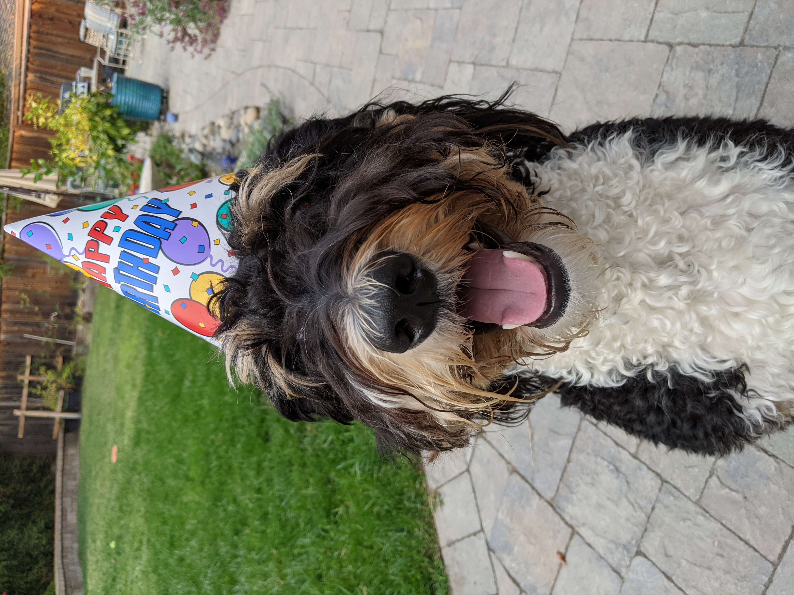

# Test images

## Still images

### Files `kodim*`

#### File [kodim03_yuv420_8bpc.avif](io/kodim03_yuv420_8bpc.avif)

License: released by the Eastman Kodak Company for unrestricted usage

#### File [kodim23_yuv420_8bpc.avif](io/kodim23_yuv420_8bpc.avif)

License: released by the Eastman Kodak Company for unrestricted usage

Source: <http://r0k.us/graphics/kodak/>

### Files `cosmos*`

#### File [cosmos1650_yuv444_10bpc_p3pq.avif](io/cosmos1650_yuv444_10bpc_p3pq.avif)

License: [Creative Commons Attribution license (reuse allowed)](https://creativecommons.org/licenses/by/3.0/legalcode)

Source: ["Cosmos Laundromat" movie](https://www.youtube.com/watch?v=Y-rmzh0PI3c) (frame at around 1 minute past the
beginning)

## Metadata

The structure can be displayed using `exiv2 -pS <file>`.

### File [dog_exif_extended_xmp_icc.jpg](dog_exif_extended_xmp_icc.jpg)

License: [same as libavif](https://github.com/AOMediaCodec/libavif/blob/main/LICENSE)

Source: Personal photo.

| address | marker      | length | data                                         |
|--------:|-------------|-------:|----------------------------------------------|
|       0 | 0xffd8 SOI  |        |                                              |
|       2 | 0xffe1 APP1 |    884 | `Exif..II*......................`            |
|     888 | 0xffe1 APP1 |    353 | `http://ns.adobe.com/xap/1.0/.<x:`           |
|    1243 | 0xffe1 APP1 |  32417 | `http://ns.adobe.com/xmp/extensio`           |
|   33662 | 0xffe0 APP0 |     16 | `JFIF.........`                              |
|         |             |        | ...                                          |
|   33818 | 0xffe2 APP2 |    612 | `ICC_PROFILE......T........mntrRG chunk 1/1` |
|         |             |        | ...                                          |

### File [paris_exif_xmp_icc.jpg](paris_exif_xmp_icc.jpg)

License: [same as libavif](https://github.com/AOMediaCodec/libavif/blob/main/LICENSE)

Source: Personal photo edited with Gimp 2.10.

| address | marker      | length | data                                         |
|--------:|-------------|-------:|----------------------------------------------|
|       0 | 0xffd8 SOI  |        |                                              |
|       2 | 0xffe0 APP0 |     16 | `JFIF.....,.,.`                              |
|      20 | 0xffe1 APP1 |   1134 | `Exif..II*......................`            |
|    1156 | 0xffe1 APP1 |   3929 | `http://ns.adobe.com/xap/1.0/.<?x`           |
|    5087 | 0xffe2 APP2 |    612 | `ICC_PROFILE......T........mntrRG chunk 1/1` |
|         |             |        | ...                                          |

### File [paris_extended_xmp.jpg](paris_extended_xmp.jpg)

License: [same as libavif](https://github.com/AOMediaCodec/libavif/blob/main/LICENSE)

Source: Metadata was extracted from `paris_exif_xmp_icc.jpg` with
`exiftool -tagsfromfile paris_exif_xmp_icc.jpg paris_exif_xmp_icc.xmp`. The text of the first book of
[De finibus bonorum et malorum](https://en.wikipedia.org/wiki/De_finibus_bonorum_et_malorum) was manually inserted in
that file under the tag `xmp:Label` and the second book under the tag `xmp:Nickname` (any `<` or `>` removed to avoid
conflicts with XMP). The file was reconstructed with
`exiftool -tagsfromfile paris_exif_xmp_icc.xmp -Exif= -icc_profile= paris_exif_xmp_icc.jpg -o paris_extended_xmp.jpg`.
The goal is to have a large XMP blob so that it can only be stored as multiple extended XMP chunks.

|  address | marker      | length | data                             |
|---------:|-------------|-------:|----------------------------------|
|        0 | 0xffd8 SOI  |        |                                  |
|        2 | 0xffe0 APP0 |     16 | `JFIF.....,.,.`                  |
|       20 | 0xffe1 APP1 |   5531 | http://ns.adobe.com/xap/1.0/.<?x |
|     5553 | 0xffe1 APP1 |  65535 | http://ns.adobe.com/xmp/extensio |
|    71090 | 0xffe1 APP1 |  65535 | http://ns.adobe.com/xmp/extensio |
|   136627 | 0xffe1 APP1 |   4791 | http://ns.adobe.com/xmp/extensio |
|          |             |        | ...                              |

### File [paris_icc_exif_xmp.png](paris_icc_exif_xmp.png)

License: [same as libavif](https://github.com/AOMediaCodec/libavif/blob/main/LICENSE)

Source: `paris_exif_xmp_icc.jpg` loaded with `avifReadImage()` then written with `avifPNGWrite()` (modified to output
metadata this way).

| address | marker | length | data                             |
|--------:|--------|-------:|----------------------------------|
|       8 | IHDR   |     13 |                                  |
|      33 | iCCP   |    386 | `libavif..(.u..+DQ..?3...E.....` |
|     431 | zTXt   |    631 | `Raw profile type exif..H...[..` |
|    1074 | zTXt   |   1076 | `Raw profile type xmp..X..YQ..8` |
|    2162 | IDAT   |        | ...                              |
|  160456 | IEND   |      0 |                                  |

### File [paris_icc_exif_xmp_at_end.png](paris_icc_exif_xmp_at_end.png)

License: [same as libavif](https://github.com/AOMediaCodec/libavif/blob/main/LICENSE)

Source: `paris_exif_xmp_icc.jpg` loaded with `avifReadImage()` then written with `avifPNGWrite()` (modified to output
metadata this way).

| address | marker | length | data                             |
|--------:|--------|-------:|----------------------------------|
|       8 | IHDR   |     13 |                                  |
|      33 | iCCP   |    386 | `libavif..(.u..+DQ..?3...E.....` |
|    2162 | IDAT   |        | ...                              |
|  151474 | eXIf   |   1126 | `II*..........................`  |
|  152612 | tEXt   |   7832 | `Raw profile type xmp..XMP.0000` |
|  160456 | IEND   |      0 |                                  |

### File [paris_exif_orientation_5.jpg](paris_exif_orientation_5.jpg)

License: [same as libavif](https://github.com/AOMediaCodec/libavif/blob/main/LICENSE)

Source: `paris_exif_xmp_icc.jpg` stripped from all metadata with `exiftool -all=` and Exif orientation added
with `exiv2 -k -M "set Exif.Image.Orientation 5"`

| address | marker      |  length | data                                 |
|--------:|-------------|--------:|--------------------------------------|
|       0 | 0xffd8 SOI  |         |                                      |
|       2 | 0xffe1 APP1 |      34 | `Exif..II*......................`    |
|         |             |         | ...                                  |

### File [paris_icc_exif_xmp.avif](paris_icc_exif_xmp.avif)

License: [same as libavif](https://github.com/AOMediaCodec/libavif/blob/main/LICENSE)

Source: Encoded from `paris_icc_exif_xmp.png` using `avifenc -s 10` at commit ed52c1b.

## Grid

### File [sofa_grid1x5_420.avif](sofa_grid1x5_420.avif)

License: [same as libavif](https://github.com/AOMediaCodec/libavif/blob/main/LICENSE)

Source: Personal photo converted with `avifenc --grid 1x5 --yuv 420` at
commit [632d131](https://github.com/AOMediaCodec/libavif/commit/632d13188f9b7faa40f20d870e792174b8b5b8e6).
