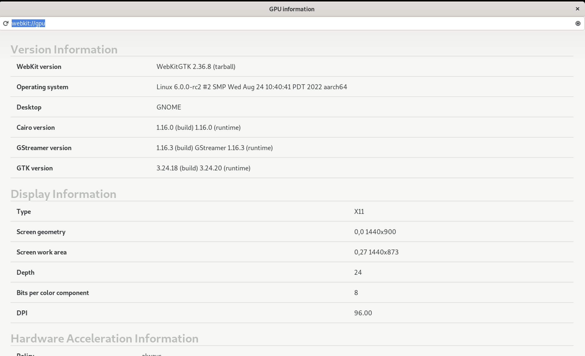

# Create a Web Browser in GTK with WebKit

This is a tutorial for creating a simple web browser with some basic functionalities in GTK with WebKit in C language.

WebKitGTK is a multi-platform toolkit for creating graphical user interfaces; it contains a complete set of widgets to be reused and combined together in development. Among them, it provides a [class@WebKitWebView] widget which can load and display web content, which allows integrating web technologies (HTML, CSS, JavaScript) in your applications&mdash;all the way to implement full-fledged browsers like [GNOME Web](https://wiki.gnome.org/Apps/Web/).

It is recommended to go through GTK's [Getting Started](https://docs.gtk.org/gtk3/getting_started.html) page to learn about the basics of using GTK.

## Coding a simple browser

In our `browse1.c` file, we add the following content to it. In the main function we create a GtkApplication called `app` and connect to it a callback function `on_app_activate`, in which a `web_view` GtkWidget loading a specified URI is created and placed in a window container.

```c
#include <webkit2/webkit2.h>

static void
on_app_activate(GtkApplication *app)
{
    GtkWidget *web_view = webkit_web_view_new();
    webkit_web_view_load_uri(WEBKIT_WEB_VIEW(web_view), "https://webkitgtk.org");

    GtkWidget* window = gtk_application_window_new(app);
    // Adds the web_view widget to the window container.
    gtk_container_add(GTK_CONTAINER(window), web_view);
    gtk_window_set_default_size(GTK_WINDOW(window), 800, 600);

    gtk_application_add_window(app, GTK_WINDOW(window));
    // Recursively shows a widget, and any child widgets (if the widget is a container).
    gtk_widget_show_all(window);
}

int
main(int argc, char *argv[])
{
    g_autoptr(GtkApplication) app = gtk_application_new(NULL, G_APPLICATION_FLAGS_NONE);
    gtk_window_set_default_icon_name("internet-web-browser");
    g_signal_connect(app, "activate", G_CALLBACK(on_app_activate), NULL);
    return g_application_run(G_APPLICATION(app), argc, argv);
}
```

## Building and running the browser

We build our code by:

```sh
cc -o browse1 browse1.c $(pkg-config webkit2gtk-4.1 --cflags --libs)
```
For example:
```sh
gcc `pkg-config --cflags gtk+-3.0 webkit2gtk-4.0` -o browse1 browse1.c `pkg-config --libs gtk+-3.0 webkit2gtk-4.0`
```

Once the executable is built we can run it:

```sh
$ ./browse1
```

And we will see a simple browser window popping up, displaying content from "https://webkitgtk.org".


## Adding more to the browser

Let’s add the title and URL of the current webpage, a refresh button, and a loading progress bar to our browser. Also, our browser does not support opening a link in a new window yet; let’s add support for that as well.

We would like to add these embellishments to the window to be created, hence we’ll add a function `create_window(GtkApplication *app, GtkWidget *web_view, const char *url)` to create our custom window and call it in `on_app_activate()`.

### Entry box

We will add an input entry box to display URL, the reload button, and the “Stop Loading” button. Then stack it vertically on top of the view of the webpage.

```c
    GtkWidget *vbox = gtk_box_new(GTK_ORIENTATION_VERTICAL, 0);

    GtkWidget *entry = g_object_new(GTK_TYPE_ENTRY,
                                    "enable-emoji-completion", FALSE,
                                    "input-purpose", GTK_INPUT_PURPOSE_URL,
                                    "primary-icon-name", "view-refresh-symbolic",
                                    "primary-icon-activatable", TRUE,
                                    "primary-icon-sensitive", TRUE,
                                    "primary-icon-tooltip-markup", "Reload",
                                    "secondary-icon-name", "process-stop-symbolic",
                                    "secondary-icon-activatable", TRUE,
                                    "secondary-icon-tooltip-markup", "Stop Loading",
                                    NULL);
    gtk_box_pack_start(GTK_BOX(vbox), entry, FALSE, FALSE, 0);
    gtk_box_pack_end(GTK_BOX(vbox), web_view, TRUE, TRUE, 0);
```
We then would like to propagate URL changes to the URL entry as the user navigates and page title changes to the title of the window containing the web view, so we bind the values to the corresponding components:

```c
    g_object_bind_property(web_view, "uri", entry, "text", G_BINDING_DEFAULT);
    g_object_bind_property(web_view, "title", window, "title", G_BINDING_DEFAULT);
```

### Enable buttons’ functionality

We should allow users to click on the reload buttons as well as to see the webpage loaded after finishing typing in the entry box and hitting “Enter” key, by having two callback functions:

```c
static void
on_url_entry_activate(GtkEntry *entry, WebKitWebView *web_view)
{
    webkit_web_view_load_uri(web_view, gtk_entry_get_text(entry));
    gtk_widget_grab_focus(GTK_WIDGET(web_view));
}

static void
on_url_entry_icon_released(GtkEntry *entry,
                           GtkEntryIconPosition icon,
                           GdkEvent *event,
                           WebKitWebView *web_view)
{
    switch (icon) {
        case GTK_ENTRY_ICON_PRIMARY:
            webkit_web_view_reload(web_view);
            break;
        case GTK_ENTRY_ICON_SECONDARY:
            webkit_web_view_stop_loading(web_view);
            break;
    }
}
```

Then connect the two functions to their respective signals for the components in `create_window()`:

```c
    /* Handle "Enter" on the entry, and clicks on its icons. */
    g_signal_connect(entry, "activate", G_CALLBACK(on_url_entry_activate), web_view);
    g_signal_connect(entry, "icon-release", G_CALLBACK(on_url_entry_icon_released), web_view);
```

We connect them to the GObject `GSignal`s&mdash;“activate” and “icon-release”&mdash;and they will be triggered accordingly.

### Enable the loading bar

We would like to notify the loading bar of the current loading progress by adding the callback function `on_webview_notify_progress()`:

```c
static void
on_webview_notify_progress(WebKitWebView *web_view, GParamSpec *pspec, GtkEntry *entry)
{
    const gboolean loading = webkit_web_view_is_loading(web_view);

    /* Activate the "Stop Reloading" button while the web_view is loading. */
    gtk_entry_set_icon_sensitive(entry, GTK_ENTRY_ICON_SECONDARY, loading);

    if (loading)
        gtk_entry_set_progress_fraction(entry, webkit_web_view_get_estimated_load_progress(web_view));
    else
        /* Once loading is done the progress is reset to zero. */
        gtk_entry_set_progress_fraction(entry, 0.0);
}
```

Also connect the function to the signal in `create_window()`. Once the web_view is going through the loading progress, the relevant components in our entry box will be notified:

```c
    /* Changes in these two properties cause an update to the load progress bar. */
    g_signal_connect(web_view, "notify::estimated-load-progress",
                     G_CALLBACK(on_webview_notify_progress), entry);
    g_signal_connect(web_view, "notify::is-loading",
                     G_CALLBACK(on_webview_notify_progress), entry);
```

### Open links in new windows

Finally, we need to support the "Open in new window" context menu item.

```c
static GtkWidget*
on_web_view_create(WebKitWebView *web_view,
                   WebKitNavigationAction *navigation_action,
                   GtkApplication *app)
{
    GtkWidget *new_view = webkit_web_view_new_with_related_view(web_view);
    GtkWidget *window = create_window(app, new_view, NULL);

    gtk_application_add_window(app, GTK_WINDOW(window));
    gtk_widget_grab_focus(new_view);
    gtk_widget_show_all(window);

    return new_view;
}
```

And connect it to the GSignal as well:

```c
    g_signal_connect(web_view, "create", G_CALLBACK(on_web_view_create), app);
```

---

Below is the code in its full version.

```c
#include <webkit2/webkit2.h>

static void
on_url_entry_activate(GtkEntry *entry, WebKitWebView *web_view)
{
    webkit_web_view_load_uri(web_view, gtk_entry_get_text(entry));
    gtk_widget_grab_focus(GTK_WIDGET(web_view));
}

static void
on_url_entry_icon_released(GtkEntry *entry,
                           GtkEntryIconPosition icon,
                           GdkEvent *event,
                           WebKitWebView *web_view)
{
    switch (icon) {
        case GTK_ENTRY_ICON_PRIMARY:
            webkit_web_view_reload(web_view);
            break;
        case GTK_ENTRY_ICON_SECONDARY:
            webkit_web_view_stop_loading(web_view);
            break;
    }
}

static void
on_webview_notify_progress(WebKitWebView *web_view, GParamSpec *pspec, GtkEntry *entry)
{
    const gboolean loading = webkit_web_view_is_loading(web_view);

    gtk_entry_set_icon_sensitive(entry, GTK_ENTRY_ICON_SECONDARY, loading);

    if (loading)
        gtk_entry_set_progress_fraction(entry, webkit_web_view_get_estimated_load_progress(web_view));
    else
        gtk_entry_set_progress_fraction(entry, 0.0);
}

static GtkWidget* create_window(GtkApplication *app, GtkWidget *web_view, const char *url);

static GtkWidget*
on_web_view_create(WebKitWebView *web_view,
                   WebKitNavigationAction *navigation_action,
                   GtkApplication *app)
{
    GtkWidget *new_view = webkit_web_view_new_with_related_view(web_view);
    GtkWidget *window = create_window(app, new_view, NULL);

    gtk_application_add_window(app, GTK_WINDOW(window));
    gtk_widget_grab_focus(new_view);
    gtk_widget_show_all(window);

    return new_view;
}

static GtkWidget*
create_window(GtkApplication *app, GtkWidget *web_view, const char *url)
{
    GtkWidget *vbox = gtk_box_new(GTK_ORIENTATION_VERTICAL, 0);

    GtkWidget *entry = g_object_new(GTK_TYPE_ENTRY,
                                    "enable-emoji-completion", FALSE,
                                    "input-purpose", GTK_INPUT_PURPOSE_URL,
                                    "primary-icon-name", "view-refresh-symbolic",
                                    "primary-icon-activatable", TRUE,
                                    "primary-icon-sensitive", TRUE,
                                    "primary-icon-tooltip-markup", "Reload",
                                    "secondary-icon-name", "process-stop-symbolic",
                                    "secondary-icon-activatable", TRUE,
                                    "secondary-icon-tooltip-markup", "Stop Loading",
                                    NULL);
    gtk_box_pack_start(GTK_BOX(vbox), entry, FALSE, FALSE, 0);
    gtk_box_pack_end(GTK_BOX(vbox), web_view, TRUE, TRUE, 0);

    /* Handle "Enter" on the entry, and clicks on its icons. */
    g_signal_connect(entry, "activate", G_CALLBACK(on_url_entry_activate), web_view);
    g_signal_connect(entry, "icon-release", G_CALLBACK(on_url_entry_icon_released), web_view);

    GtkWidget* window = gtk_application_window_new(app);
    gtk_window_set_default_size(GTK_WINDOW(window), 800, 600);
    gtk_container_add(GTK_CONTAINER(window), vbox);

    /*
     * Propagate URL changes to the URL entry as the user navigates and page
     * title changes to the title of the window containing the web view.
     */
    g_object_bind_property(web_view, "uri", entry, "text", G_BINDING_DEFAULT);
    g_object_bind_property(web_view, "title", window, "title", G_BINDING_DEFAULT);

    /* This is needed to support the "Open in new window" context menu item. */
    g_signal_connect(web_view, "create", G_CALLBACK(on_web_view_create), app);

    /* Changes in these two properties cause an update to the load progress bar. */
    g_signal_connect(web_view, "notify::estimated-load-progress",
                     G_CALLBACK(on_webview_notify_progress), entry);
    g_signal_connect(web_view, "notify::is-loading",
                     G_CALLBACK(on_webview_notify_progress), entry);

    if (url)
        webkit_web_view_load_uri(WEBKIT_WEB_VIEW(web_view), url);

    return window;
}

static void
on_app_activate(GtkApplication *app)
{
    /* Create the first window. */
    GtkWidget *window = create_window(app, webkit_web_view_new(), "webkit://gpu");
    gtk_application_add_window(app, GTK_WINDOW(window));
    gtk_widget_show_all(window);
}

int
main(int argc, char *argv[])
{
    g_autoptr(GtkApplication) app = gtk_application_new(NULL, G_APPLICATION_FLAGS_NONE);
    gtk_window_set_default_icon_name("internet-web-browser");
    g_signal_connect(app, "activate", G_CALLBACK(on_app_activate), NULL);
    return g_application_run(G_APPLICATION(app), argc, argv);
}
```

### Building and running

Don’t forget to add `browse2` to the build file:

```makefile
executable('browse2', 'browse2.c', dependencies: webkitgtk_dep)
```

Running the new executable now renders our updated browser.


---

**References**

[1] A video tutorial (albeit in older version) can be found [here](https://www.youtube.com/watch?v=ONk1uvVcVnM).
