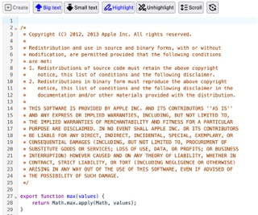

## Description

Lots of people edit text content in the browser. Lots of that content, like WYSIWYG content or code, is too rich or complex to represent well with a `<textarea>`. Sites typically rely on advanced editor libraries for this, and we should make sure browsers perform well at common patterns used by them.

## Screenshot

## What are we testing

-   Basic DOM and editing
-   Virtualization (DOM content changing during scroll)
-   Basic flex layout with SVG icons

## How are we testing

The test simulates a real-world user flow by loading a number of popular editor libraries. After the initial load is complete, the following steps are timed:

-   Setting to a fairly large value
-   "Formatting" the text - in code editors this means turning on syntax highlighting, and in WYSISWYG this means bolding all of the contents
-   Scrolling to the bottom of the editor

## Developer Documentation

The app was created with `npm create vite@latest editors`, and can be previewed with `npm run dev`. In order to update the files run in the harness you have to use `npm run build` which will recreate the `dist/` directory.

The built test can be loaded within the harness using i.e. http://localhost:7000/?suite=Editor-CodeMirror&startAutomatically=true, or the static versions at http://localhost:7000/resources/editors/dist/.
