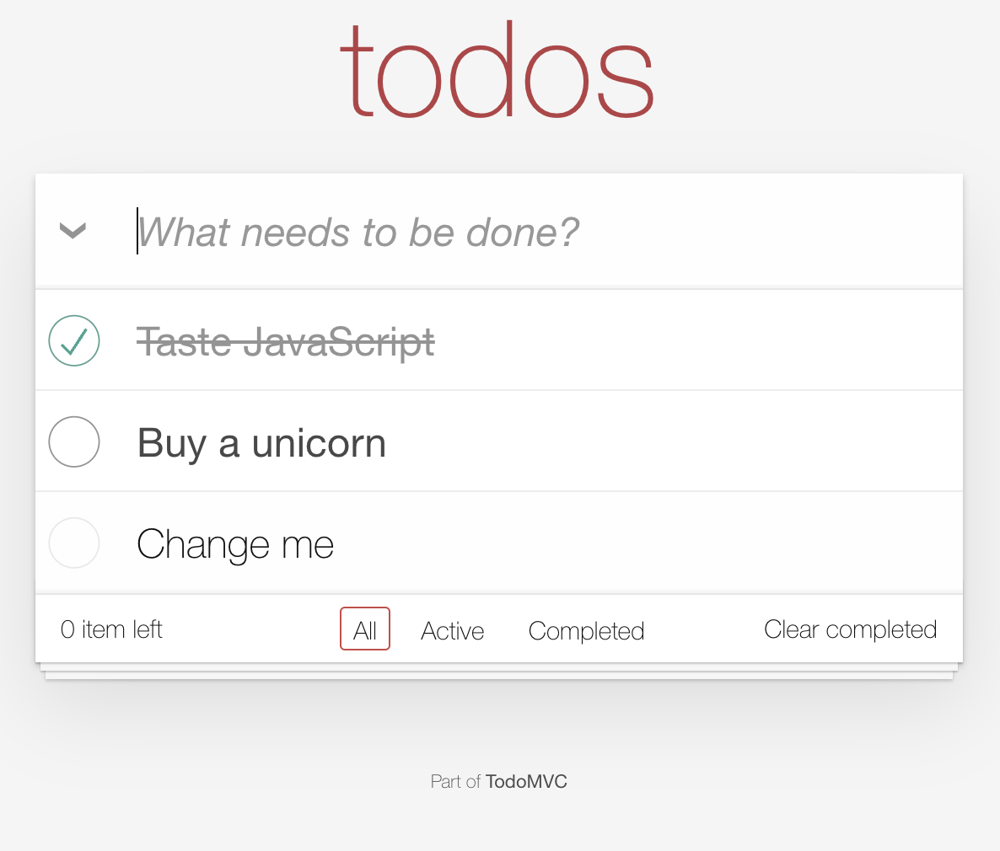

# todomvc-css

> **_NOTE:_** This is not an official repo from todomvc and only serves as personal research.

## Overview

This todomvc-css repo implements changes to adhere to some a11y audit results that needed to get addressed.

-   Visually, there are only minor changes introduced, that overall don't impact the look and feel of a todomvc application.
-   Structurely, changes have been made to ensure formfields are treated correctly and that the application is accessible to a broader audience.



## How to use

This package allows you to use the stylesheets in various ways, either by including the complete rules (index.css, index.min.css) in a link tag, or by importing partial css / css module files in your code.

install the package

```bash
npm install todomvc-app-css-alt
```

including the styles in html with a link tag

```html
<link href="todomvc-app-css-alt/dist/index.min.css" rel="stylesheet" />
```

importing the styles in JavaScript:

```javascript
import "todomvc-app-css-alt/dist/global.css";
```

importing a css module (React example):

```javascript
import styles from "todomvc-app-css-alt/dist/footer.module.css";

export default function Footer() {
    return (
        <footer className={styles.footer}>
            <p className={styles["footer-text"]}>
                Part of{" "}
                <a className={styles["footer-link"]} href="http://todomvc.com">
                    TodoMVC
                </a>
            </p>
        </footer>
    );
}
```

constructable stylesheets:

```javascript
import sheet from "todomvc-app-css-alt/dist/footer.constructable.js";

document.adoptedStyleSheets = [...document.adoptedStyleSheets, sheet];
```

constructable stylesheets in shadow DOM:

```javascript
import sheet from "todomvc-app-css-alt/dist/footer.constructable.js";

const node = document.createElement("div");
const shadow = node.attachShadow({ mode: "open" });
shadow.adoptedStyleSheets = [sheet];
```
